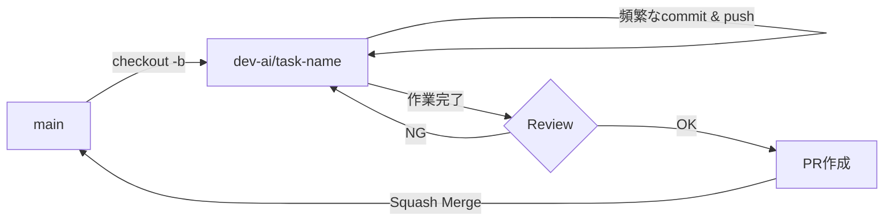

# ブランチ運用規則

## ブランチ命名規則

### AIエージェント開発ブランチ
複数のコーディングエージェントを使用した協調開発用のブランチ

**命名規則:** `dev-ai/<unique-name>`

**例:**
- `dev-ai/gitignore-cleanup`
- `dev-ai/feature-implementation`
- `dev-ai/bug-fix-issue-123`

**用途:**
- AIエージェント間のコミュニケーション
- 頻繁なコミット・プッシュによる進捗共有
- 実験的な実装やプロトタイピング

### その他のブランチ
- `main` - 本番用の安定版ブランチ
- `feature/<feature-name>` - 新機能開発（人間の開発者用）
- `bugfix/<bug-name>` - バグ修正
- `hotfix/<issue-name>` - 緊急修正

## コミットメッセージ規則

Conventional Commits形式を使用:

```
<type>: <subject>

[optional body]

[optional footer]
```

### Type
- `feat`: 新機能
- `fix`: バグ修正
- `docs`: ドキュメントのみの変更
- `style`: コードの意味に影響しない変更（フォーマット等）
- `refactor`: バグ修正や機能追加を伴わないコード変更
- `perf`: パフォーマンス改善
- `test`: テストの追加・修正
- `chore`: ビルドプロセスやツールの変更
- `ci`: CI設定の変更

### 例
```
feat: Add both_hands estimator support with rectangular ROI
chore: Add test files and IDE configs to .gitignore
fix: Correct ROI vector direction in MediaPipePoseBothHandsROI
docs: Update BRANCHING_STRATEGY with merge rules
```

## マージルール

### dev-ai/* ブランチから main へのマージ

1. **マージ前の確認事項**
   - [ ] 全てのテストが成功している
   - [ ] コードレビューが完了している（人間による確認推奨）
   - [ ] ドキュメントが更新されている
   - [ ] コミット履歴が整理されている

2. **マージ方法**

   **オプション A: Squash Merge（推奨）**
   ```bash
   git checkout main
   git merge --squash dev-ai/<branch-name>
   git commit -m "feat: <summary of changes>"
   git push origin main
   ```
   
   利点: AIエージェントの頻繁なコミットを1つにまとめて履歴を整理

   **オプション B: Merge Commit**
   ```bash
   git checkout main
   git merge --no-ff dev-ai/<branch-name>
   git push origin main
   ```
   
   利点: AIエージェント間の開発プロセスを完全に保存

3. **マージ後の処理**
   ```bash
   # ローカルブランチの削除
   git branch -d dev-ai/<branch-name>
   
   # リモートブランチの削除
   git push origin --delete dev-ai/<branch-name>
   ```

### Pull Request経由のマージ（推奨）

GitHubのPull Request機能を使用する場合:

1. `dev-ai/<branch-name>`から`main`へのPRを作成
2. PR説明に以下を含める:
   - 変更内容の概要
   - AIエージェントのタスク内容
   - テスト結果
   - 関連するissue番号
3. レビュー完了後、Squash and Mergeでマージ
4. マージ後、ブランチを自動削除

## AIエージェント協調作業のワークフロー



## ベストプラクティス

### AIエージェント開発時
- **作業開始前**: 他のdev-aiブランチの状況を確認する（後述の「他のdev-aiブランチの確認」参照）
- 小さな単位で頻繁にコミット・プッシュする
- コミットメッセージは明確に記述する
- 大きな変更は複数のdev-aiブランチに分割する
- mainへのマージ前に必ずテストを実行する

### ブランチ管理
- 作業完了後は速やかにマージしてブランチを削除
- 長期間マージされないブランチは定期的に見直す
- mainブランチは常にデプロイ可能な状態を保つ

## 他のdev-aiブランチの確認

新しい作業を開始する前に、他のAIエージェントが作業中のブランチを確認し、重複や競合を避けます。

### 1. リモートブランチの最新情報を取得
```bash
# リモートの最新状態を取得（ブランチ削除も反映）
git fetch origin --prune
```

### 2. dev-aiブランチ一覧の確認
```bash
# リモートのdev-aiブランチを一覧表示
git branch -r | grep 'origin/dev-ai/'

# または詳細情報付きで表示
git for-each-ref --sort=-committerdate refs/remotes/origin/dev-ai/ --format='%(committerdate:short) %(refname:short) %(subject)'
```

### 3. 特定ブランチの変更内容を確認
```bash
# ブランチの変更ファイル一覧
git diff main...origin/dev-ai/<branch-name> --name-status

# ブランチの詳細な差分
git diff main...origin/dev-ai/<branch-name>

# ブランチのコミットログ
git log main..origin/dev-ai/<branch-name> --oneline
```

### 4. 他ブランチの変更を取り込む必要がある場合
```bash
# 新しい作業ブランチを作成
git checkout -b dev-ai/<new-task>

# 他のdev-aiブランチの変更を取り込む
git merge origin/dev-ai/<other-branch>

# または、特定のコミットのみを取り込む
git cherry-pick <commit-hash>
```

### 5. 確認すべきポイント
- [ ] 同じファイルを編集している他のブランチはないか
- [ ] 自分の作業と関連する機能開発が進行中でないか
- [ ] 取り込むべき有用な変更があるか
- [ ] コンフリクトが発生する可能性はないか

### 例: 作業開始時のフロー
```bash
# 1. mainブランチを最新化
git checkout main
git pull origin main

# 2. リモートブランチを確認
git fetch origin --prune
git branch -r | grep 'origin/dev-ai/'

# 3. 関連ブランチの内容を確認
git log main..origin/dev-ai/gitignore-cleanup --oneline
git diff main...origin/dev-ai/gitignore-cleanup --name-status

# 4. 新しい作業ブランチを作成
git checkout -b dev-ai/new-feature

# 5. 必要に応じて他ブランチの変更を取り込む
git merge origin/dev-ai/gitignore-cleanup
```

## トラブルシューティング

### コンフリクトが発生した場合
```bash
# mainの最新を取得
git checkout main
git pull origin main

# 作業ブランチにマージ
git checkout dev-ai/<branch-name>
git merge main

# コンフリクトを解決
# ... (ファイルを編集) ...

git add .
git commit -m "chore: Resolve merge conflicts with main"
git push origin dev-ai/<branch-name>
```

### ブランチの同期
```bash
# リモートの最新状態を取得
git fetch origin

# 他のエージェントの変更を取り込む
git pull origin dev-ai/<branch-name>
```
