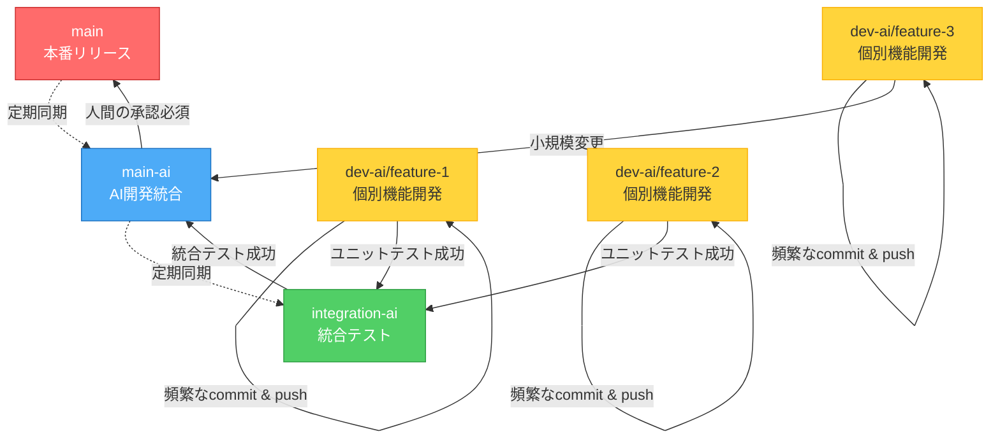

# ブランチ運用規則

## ブランチ命名規則

### AIエージェント開発ブランチ
複数のコーディングエージェントを使用した協調開発用のブランチ

**命名規則:** `dev-ai/<unique-name>`

**例:**
- `dev-ai/gitignore-cleanup`
- `dev-ai/feature-implementation`
- `dev-ai/bug-fix-issue-123`

**用途:**
- AIエージェント間のコミュニケーション
- 頻繁なコミット・プッシュによる進捗共有
- 実験的な実装やプロトタイピング

### ブランチ階層
プロジェクトは以下の階層構造でブランチを管理します:

```
main (本番リリース)
  ↑
main-ai (AI開発統合・人間レビュー待ち)
  ↑
integration-ai (統合テスト・検証)
  ↑
dev-ai/* (個別機能開発)
```

### コアブランチ
- `main` - 本番用の安定版ブランチ（人間の最終承認後にデプロイ）
- `main-ai` - すべてのdev-aiブランチを統合したAI開発統合ブランチ（AIエージェントがマージ可能な最上位）
- `integration-ai` - 複数機能の統合テスト用ブランチ（main-aiへのマージ前検証）

### 開発ブランチ
- `dev-ai/<feature-name>` - AIエージェント個別開発ブランチ
- `feature/<feature-name>` - 新機能開発(人間の開発者用)
- `bugfix/<bug-name>` - バグ修正
- `hotfix/<issue-name>` - 緊急修正

## コミットメッセージ規則

Conventional Commits形式を使用:

```
<type>: <subject>

[optional body]

[optional footer]
```

### Type
- `feat`: 新機能
- `fix`: バグ修正
- `docs`: ドキュメントのみの変更
- `style`: コードの意味に影響しない変更（フォーマット等）
- `refactor`: バグ修正や機能追加を伴わないコード変更
- `perf`: パフォーマンス改善
- `test`: テストの追加・修正
- `chore`: ビルドプロセスやツールの変更
- `ci`: CI設定の変更

### 例
```
feat: Add both_hands estimator support with rectangular ROI
chore: Add test files and IDE configs to .gitignore
fix: Correct ROI vector direction in MediaPipePoseBothHandsROI
docs: Update BRANCHING_STRATEGY with merge rules
```

## マージルール

### AIエージェントのマージ権限

**AIエージェントは `main-ai` までマージ可能**
- dev-ai/* → integration-ai: 自動マージ可能
- integration-ai → main-ai: テスト通過後に自動マージ可能
- main-ai → main: **人間の最終レビューと承認が必須**

### dev-ai/* ブランチから integration-ai へのマージ

1. **マージ前の確認事項**
   - [ ] 全てのユニットテストが成功している
   - [ ] コミット履歴が整理されている
   - [ ] 関連ドキュメントが更新されている

2. **マージ方法**

   **GitHub Pull Request経由（推奨）**
   ```bash
   # PRを作成（GitHub CLI使用）
   gh pr create --base integration-ai --head dev-ai/<branch-name> \
     --title "feat: <summary>" \
     --body "## Changes\n- <change1>\n- <change2>"
   ```

   **直接マージ**
   ```bash
   git checkout integration-ai
   git merge --no-ff dev-ai/<branch-name> -m "feat: <summary>"
   git push origin integration-ai
   ```

### integration-ai から main-ai へのマージ

1. **マージ前の確認事項**
   - [ ] 統合テストが成功している
   - [ ] 複数機能間の相互作用が検証されている
   - [ ] パフォーマンステストが完了している

2. **マージ方法**

   **Squash Merge（推奨）**
   ```bash
   git checkout main-ai
   git merge --squash integration-ai
   git commit -m "feat: <summary of integrated features>"
   git push origin main-ai
   ```

### main-ai から main へのマージ

**⚠️ 人間の承認が必須**

1. **マージ前の確認事項**
   - [ ] 全てのテストが成功している（単体・統合・E2E）
   - [ ] コードレビューが完了している（人間による詳細確認）
   - [ ] ドキュメントが完全に更新されている
   - [ ] 本番環境への影響が評価されている
   - [ ] ロールバック計画が準備されている

2. **マージ方法**

   **Pull Request経由（必須）**
   ```bash
   # PRを作成
   gh pr create --base main --head main-ai \
     --title "release: <version> - <summary>" \
     --body "## AI Development Summary\n...\n## Human Review Required"
   
   # レビュー・承認後、GitHub UIでマージ
   ```

### dev-ai/* ブランチから main-ai への直接マージ（小規模変更）

**条件**: 独立した小規模な変更で、integration-ai での統合テストが不要な場合

1. **マージ前の確認事項**
   - [ ] 全てのユニットテストが成功している
   - [ ] 他の機能への影響がない
   - [ ] ドキュメントが更新されている

2. **マージ方法**

   **オプション A: Squash Merge（推奨）**
   ```bash
   git checkout main-ai
   git merge --squash dev-ai/<branch-name>
   git commit -m "feat: <summary of changes>"
   git push origin main-ai
   ```
   
   利点: AIエージェントの頻繁なコミットを1つにまとめて履歴を整理

   **オプション B: Merge Commit**
   ```bash
   git checkout main-ai
   git merge --no-ff dev-ai/<branch-name>
   git push origin main-ai
   ```
   
   利点: AIエージェント間の開発プロセスを完全に保存

3. **マージ後の処理**
   ```bash
   # ローカルブランチの削除
   git branch -d dev-ai/<branch-name>
   
   # リモートブランチの削除
   git push origin --delete dev-ai/<branch-name>
   ```

## AIエージェント協調作業のワークフロー



### 開発フロー説明

1. **dev-ai/* での開発**
   - AIエージェントが個別機能を開発
   - 小さな単位で頻繁にコミット・プッシュ
   - ユニットテスト成功後、integration-ai または main-ai へ

2. **integration-ai での統合**
   - 複数の dev-ai ブランチをマージ
   - 統合テストと相互作用の検証
   - 問題なければ main-ai へマージ

3. **main-ai での統合**
   - AI開発成果を一括管理
   - 全てのテストスイートを実行
   - 人間のレビュー待ちステータス

4. **main へのリリース**
   - 人間による最終レビューと承認
   - 本番環境へのデプロイ
   - バージョンタグの付与


### main-ai ブランチの運用

**目的**: 複数のdev-aiブランチの変更を統合し、人間レビュー前の最終検証を行う

**作成方法**:
```bash
# mainから作成
git checkout main
git pull origin main
git checkout -b main-ai

# 各dev-aiブランチをマージ（またはintegration-aiから）
git merge origin/integration-ai --no-ff -m "chore: Merge integration-ai into main-ai"

# リモートにプッシュ
git push -u origin main-ai
```

**用途**:
- AI開発成果の一括管理
- mainへのマージ前の最終確認
- 継続的な統合開発のベースブランチ
- **AIエージェントがマージ可能な最上位ブランチ**

**同期方法**:
```bash
# mainの変更を取り込む（定期的に実行）
git checkout main-ai
git pull origin main
git merge origin/main --no-ff -m "chore: Sync main-ai with main"
git push origin main-ai

# integration-aiへも反映
git checkout integration-ai
git merge origin/main-ai --no-ff -m "chore: Sync integration-ai with main-ai"
git push origin integration-ai
```

**注意**:
- main-aiは定期的にmainと同期すること
- mainへのマージは**必ず人間の承認を経ること**
- CI/CDは main と main-ai でのみ自動実行される

### integration-ai ブランチの運用

**目的**: 複数のdev-aiブランチを統合し、相互作用をテストする

**作成方法**:
```bash
# main-aiから作成
git checkout main-ai
git pull origin main-ai
git checkout -b integration-ai
git push -u origin integration-ai
```

**用途**:
- 複数機能の統合テスト
- 機能間の相互作用の検証
- main-aiへのマージ前の品質確認

**マージフロー**:
```bash
# 複数のdev-aiブランチをマージ
git checkout integration-ai
git merge origin/dev-ai/feature-1 --no-ff -m "feat: Integrate feature-1"
git merge origin/dev-ai/feature-2 --no-ff -m "feat: Integrate feature-2"

# 統合テスト実行
pytest tests/

# 成功後、main-aiへ
git checkout main-ai
git merge --squash integration-ai
git commit -m "feat: Integrate features 1 and 2"
git push origin main-ai
```

**注意**:
- CI/CDは integration-ai では自動実行されない（リソース節約）
- 手動でテストを実行して品質を確認すること
- main-aiと定期的に同期すること

## CI/CD自動化

### GitHub Actions実行ブランチ

**自動CI実行対象**: `main` と `main-ai` のみ

```yaml
# .github/workflows/ci.yml
on:
  push:
    branches: [ main, main-ai ]
  pull_request:
    branches: [ main, main-ai ]
```

**理由**:
- リソースの効率的な使用
- integration-ai と dev-ai/* は手動テストで十分
- 本番リリース前（main）とAI統合完了時（main-ai）の品質保証に集中

**開発ブランチでのテスト**:
```bash
# dev-ai/* や integration-ai では手動でテストを実行
pytest tests/ --cov=src/cslrtools2 --cov-report=term-missing

# または、タスク実行
uv run pytest
```

### テストレベル

| ブランチ | テストレベル | 実行方法 |
|---------|------------|----------|
| dev-ai/* | ユニットテスト | 手動（開発者/AIエージェント） |
| integration-ai | 統合テスト | 手動 |
| main-ai | 全テストスイート | **自動CI** |
| main | 全テストスイート + E2E | **自動CI + 手動検証** |

## ベストプラクティス

### AIエージェント開発時
- 小さな単位で頻繁にコミット・プッシュする
- コミットメッセージは明確に記述する
- 大きな変更は複数のdev-aiブランチに分割する
- **dev-ai/* では必ずユニットテストを実行してからマージする**
- **小規模独立変更は main-ai へ直接マージ可能**
- **複数機能統合は integration-ai 経由を推奨**

### ブランチ管理
- 作業完了後は速やかにマージしてブランチを削除
- 長期間マージされないブランチは定期的に見直す
- **main-ai は定期的に main と同期する**
- **integration-ai は定期的に main-ai と同期する**
- mainブランチは常にデプロイ可能な状態を保つ

### マージ戦略の選択

**Squash Merge を使う場合**:
- 頻繁な小規模コミットが多い
- コミット履歴を整理したい
- dev-ai/* → main-ai の直接マージ

**Merge Commit を使う場合**:
- 開発プロセスを保存したい
- 複数エージェントの協調作業を記録
- dev-ai/* → integration-ai のマージ

**Fast-forward を使う場合**:
- 単一コミットの小規模変更
- 緊急のホットフィックス

## ワークスペース構成と Worktree の運用（オンデマンド構成）

このプロジェクトは Git Worktree を利用した並列ワークスペース構成を**オンデマンド**で行います。必要なタスクが発生した際に、そのタスク専用のワークツリーを作成し、作業完了後は削除する運用を推奨します。

### オンデマンド構成の理由
- ワークツリーを事前に用意せず、必要なときだけ作成することで、ディスク容量と管理コストを削減
- タスク固有の環境を明確に分離し、作業終了後にクリーンアップできる
- 複数の開発者/エージェントが同時に異なるタスクを進める場合も柔軟に対応可能

### 基本的な運用フロー

**1. 新しいタスクのワークツリーを作成**

```powershell
# 新しいブランチでワークツリーを作成
git worktree add ..\cslrtools2-<task-name> -b dev-ai/<task-name>

# または、既存のブランチをチェックアウト
git worktree add ..\cslrtools2-<task-name> origin/dev-ai/<existing-branch>
```

**2. ワークツリーで環境をセットアップ**

```powershell
cd ..\cslrtools2-<task-name>

# 依存関係を同期（uvを使用）
uv sync

# MediaPipeが必要な場合
# uv sync --group mediapipe

# テストを実行して環境を確認
uv run pytest -q
```

**3. 作業完了後にワークツリーを削除**

```powershell
# 変更をコミット・プッシュした後
cd ..\<元のディレクトリ>

# ワークツリーを削除
git worktree remove ..\cslrtools2-<task-name>

# マージ済みならリモートブランチも削除
git push origin --delete dev-ai/<task-name>
```

### 重要なポイント
- **各ワークツリーで独立した `.venv` を保持**（共有しない）
- **必ず `uv run python` を使ってスクリプトを実行**（bare python コマンドは使わない）
- **同じブランチを複数のワークツリーで編集しない**（Git が禁止しています）
- **長期間放置しない**（作業が完了したらワークツリーを削除してリソースを解放）

### クイックリファレンス

```powershell
# 現在のワークツリー一覧を確認
git worktree list

# ワークツリー作成からクリーンアップまで（例）
git worktree add ..\cslrtools2-fix-bug -b dev-ai/fix-bug
cd ..\cslrtools2-fix-bug
uv sync
# ... 作業 ...
git add .
git commit -m "fix: Resolve bug"
git push origin dev-ai/fix-bug
cd ..\<元のディレクトリ>
git worktree remove ..\cslrtools2-fix-bug
```

### 運用の注意
- ワークツリーをまたいで同じブランチを編集すると競合やデータ損失の原因になります
- CI やデプロイの参照ブランチ名を変更する場合はスクリプトや設定を合わせて更新してください
- `.venv` や `__pycache__` は Git 管理対象外なので、各ワークツリーで再生成が必要です

## Worktree 用 Copilot 指示フロー

新規に Worktree（ワークスペース）を作成した際、そこの作業で実行したいタスクやエージェントへの指示をリポジトリに保存するために、ワークスペース専用の指示ファイルを配置するフローを推奨します。

ファイル名 (推奨): `.github/worktree-copilot-instructions.md`

目的:
- その Worktree で行いたい範囲（テスト、実験、データ生成など）を明確にして、コードエージェントが自動化タスクを理解・実行できるようにする。
- 作業内容をワークスペースに紐づけて履歴化することで、後からの追跡や再実行を容易にする。

テンプレート（例）:

```markdown
# worktree: <worktree-name or branch>

## Goal
- 短い一文で目的を説明。

## Tasks
- task-1: 具体的な操作（ex: run tests, create dataset slice）
- task-2: 期待する成果物（ex: zarr files at /data/tests/...）

## Constraints
- time: 30m
- resources: no GPU

## Notes
- 追加の背景情報や参照先ファイル
```

推奨フロー:
1. Worktree を作成する際に `.github/worktree-copilot-instructions.md` を作成する（ローカルで編集）。
2. 指示ファイルをコミットして push する。Worktree をチェックアウトしているコラボレーターや自動化がこれを参照できます。
3. コードエージェントはこのファイルを読み取り、指定タスクを実行／提案を作成します。

運用上の注意:
- 指示ファイルは作業に応じて細かく分けてもよい（例: `tests-enhancement.md` など）。
- センシティブな情報（API キー等）はここに書かない。必要な場合はシークレット管理を使う。

---


---


## トラブルシューティング

### コンフリクトが発生した場合

**dev-ai/* でのコンフリクト**:
```bash
# main-aiの最新を取得
git checkout main-ai
git pull origin main-ai

# 作業ブランチにマージ
git checkout dev-ai/<branch-name>
git merge main-ai

# コンフリクトを解決
# ... (ファイルを編集) ...

git add .
git commit -m "chore: Resolve merge conflicts with main-ai"
git push origin dev-ai/<branch-name>
```

**integration-ai でのコンフリクト**:
```bash
# main-aiの最新を取得して統合
git checkout integration-ai
git pull origin main-ai
git merge origin/main-ai

# コンフリクトを解決
git add .
git commit -m "chore: Resolve merge conflicts with main-ai"
git push origin integration-ai
```

**main-ai でのコンフリクト**:
```bash
# mainの最新を取得
git checkout main
git pull origin main

# main-aiに反映
git checkout main-ai
git merge main

# コンフリクトを解決
git add .
git commit -m "chore: Resolve merge conflicts with main"
git push origin main-ai
```

### ブランチの同期
```bash
# リモートの最新状態を取得
git fetch origin

# 他のエージェントの変更を取り込む
git pull origin dev-ai/<branch-name>
```

### 誤ってmainに直接コミットした場合
```bash
# コミットを取り消して作業ブランチに移動
git reset --soft HEAD~1
git checkout -b dev-ai/fix-accidental-commit
git commit -m "fix: Move accidental commit to proper branch"
git push origin dev-ai/fix-accidental-commit

# mainを元に戻す
git checkout main
git reset --hard origin/main
```

### CI失敗時の対処

**main-ai でのCI失敗**:
1. ローカルでテストを実行して原因を特定
2. dev-ai/* で修正を実施
3. 修正をmain-aiにマージ
4. CIが成功することを確認

**main でのCI失敗**:
1. **緊急**: main-aiでhotfixブランチを作成
2. 修正後、PRを作成して人間のレビューを受ける
3. 承認後、mainにマージ

## 権限とアクセス制御

### AIエージェントの権限

**許可される操作**:
- ✅ dev-ai/* ブランチの作成・コミット・プッシュ
- ✅ dev-ai/* → integration-ai へのマージ
- ✅ integration-ai → main-ai へのマージ
- ✅ dev-ai/* → main-ai への直接マージ（小規模変更）
- ✅ GitHub Issueの作成・コメント
- ✅ Pull Requestの作成（main-ai → mainを除く）

**禁止される操作**:
- ❌ main ブランチへの直接プッシュ
- ❌ main-ai → main へのマージ（人間の承認が必須）
- ❌ mainブランチの履歴の書き換え
- ❌ リリースタグの作成

### 人間の開発者の責任

**必須の確認事項**:
- main-ai → main のPRレビューと承認
- 本番デプロイの最終判断
- セキュリティ関連の変更の確認
- ライセンス・法的問題の確認

**推奨される確認事項**:
- AIエージェントの開発方針の確認
- 大規模リファクタリングのレビュー

