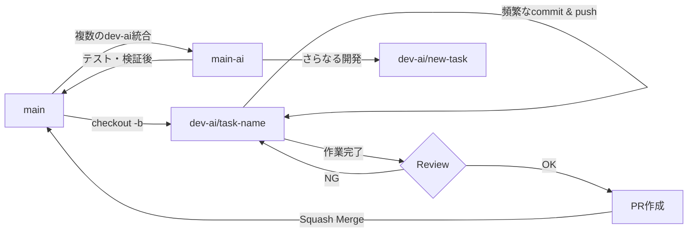

# ブランチ運用規則

## ブランチ命名規則

### AIエージェント開発ブランチ
複数のコーディングエージェントを使用した協調開発用のブランチ

**命名規則:** `dev-ai/<unique-name>`

**例:**
- `dev-ai/gitignore-cleanup`
- `dev-ai/feature-implementation`
- `dev-ai/bug-fix-issue-123`

**用途:**
- AIエージェント間のコミュニケーション
- 頻繁なコミット・プッシュによる進捗共有
- 実験的な実装やプロトタイピング

### その他のブランチ
- `main` - 本番用の安定版ブランチ
- `main-ai` - すべてのdev-aiブランチを統合したAI開発統合ブランチ
- `feature/<feature-name>` - 新機能開発(人間の開発者用)
- `bugfix/<bug-name>` - バグ修正
- `hotfix/<issue-name>` - 緊急修正

## コミットメッセージ規則

Conventional Commits形式を使用:

```
<type>: <subject>

[optional body]

[optional footer]
```

### Type
- `feat`: 新機能
- `fix`: バグ修正
- `docs`: ドキュメントのみの変更
- `style`: コードの意味に影響しない変更（フォーマット等）
- `refactor`: バグ修正や機能追加を伴わないコード変更
- `perf`: パフォーマンス改善
- `test`: テストの追加・修正
- `chore`: ビルドプロセスやツールの変更
- `ci`: CI設定の変更

### 例
```
feat: Add both_hands estimator support with rectangular ROI
chore: Add test files and IDE configs to .gitignore
fix: Correct ROI vector direction in MediaPipePoseBothHandsROI
docs: Update BRANCHING_STRATEGY with merge rules
```

## マージルール

### dev-ai/* ブランチから main へのマージ

1. **マージ前の確認事項**
   - [ ] 全てのテストが成功している
   - [ ] コードレビューが完了している（人間による確認推奨）
   - [ ] ドキュメントが更新されている
   - [ ] コミット履歴が整理されている

2. **マージ方法**

   **オプション A: Squash Merge（推奨）**
   ```bash
   git checkout main
   git merge --squash dev-ai/<branch-name>
   git commit -m "feat: <summary of changes>"
   git push origin main
   ```
   
   利点: AIエージェントの頻繁なコミットを1つにまとめて履歴を整理

   **オプション B: Merge Commit**
   ```bash
   git checkout main
   git merge --no-ff dev-ai/<branch-name>
   git push origin main
   ```
   
   利点: AIエージェント間の開発プロセスを完全に保存

3. **マージ後の処理**
   ```bash
   # ローカルブランチの削除
   git branch -d dev-ai/<branch-name>
   
   # リモートブランチの削除
   git push origin --delete dev-ai/<branch-name>
   ```

### Pull Request経由のマージ（推奨）

GitHubのPull Request機能を使用する場合:

1. `dev-ai/<branch-name>`から`main`へのPRを作成
2. PR説明に以下を含める:
   - 変更内容の概要
   - AIエージェントのタスク内容
   - テスト結果
   - 関連するissue番号
3. レビュー完了後、Squash and Mergeでマージ
4. マージ後、ブランチを自動削除

## AIエージェント協調作業のワークフロー



### main-ai ブランチの運用

**目的**: 複数のdev-aiブランチの変更を統合し、一括テスト・検証を行う

**作成方法**:
```bash
# mainから作成
git checkout main
git pull origin main
git checkout -b main-ai

# 各dev-aiブランチをマージ
git merge origin/dev-ai/branch1 --no-ff -m "chore: Merge dev-ai/branch1 into main-ai"
git merge origin/dev-ai/branch2 --no-ff -m "refactor: Merge dev-ai/branch2 into main-ai"

# リモートにプッシュ
git push -u origin main-ai
```

**用途**:
- 複数のdev-aiブランチの統合テスト
- AI開発成果の一括検証
- mainへのマージ前の最終確認
- 継続的な統合開発のベースブランチ

**注意**:
- main-aiは定期的にmainと同期すること
- mainへのマージはmain-aiからのSquash Mergeを推奨

## ベストプラクティス

### AIエージェント開発時
- 小さな単位で頻繁にコミット・プッシュする
- コミットメッセージは明確に記述する
- 大きな変更は複数のdev-aiブランチに分割する
- mainへのマージ前に必ずテストを実行する

### ブランチ管理
- 作業完了後は速やかにマージしてブランチを削除
- 長期間マージされないブランチは定期的に見直す
- mainブランチは常にデプロイ可能な状態を保つ

## ワークスペース構成と Worktree の運用（オンデマンド構成）

このプロジェクトは Git Worktree を利用した並列ワークスペース構成を**オンデマンド**で行います。必要なタスクが発生した際に、そのタスク専用のワークツリーを作成し、作業完了後は削除する運用を推奨します。

### オンデマンド構成の理由
- ワークツリーを事前に用意せず、必要なときだけ作成することで、ディスク容量と管理コストを削減
- タスク固有の環境を明確に分離し、作業終了後にクリーンアップできる
- 複数の開発者/エージェントが同時に異なるタスクを進める場合も柔軟に対応可能

### 基本的な運用フロー

**1. 新しいタスクのワークツリーを作成**

```powershell
# 新しいブランチでワークツリーを作成
git worktree add ..\cslrtools2-<task-name> -b dev-ai/<task-name>

# または、既存のブランチをチェックアウト
git worktree add ..\cslrtools2-<task-name> origin/dev-ai/<existing-branch>
```

**2. ワークツリーで環境をセットアップ**

```powershell
cd ..\cslrtools2-<task-name>

# 依存関係を同期（uvを使用）
uv sync

# MediaPipeが必要な場合
# uv sync --group mediapipe

# テストを実行して環境を確認
uv run pytest -q
```

**3. 作業完了後にワークツリーを削除**

```powershell
# 変更をコミット・プッシュした後
cd ..\<元のディレクトリ>

# ワークツリーを削除
git worktree remove ..\cslrtools2-<task-name>

# マージ済みならリモートブランチも削除
git push origin --delete dev-ai/<task-name>
```

### 重要なポイント
- **各ワークツリーで独立した `.venv` を保持**（共有しない）
- **必ず `uv run python` を使ってスクリプトを実行**（bare python コマンドは使わない）
- **同じブランチを複数のワークツリーで編集しない**（Git が禁止しています）
- **長期間放置しない**（作業が完了したらワークツリーを削除してリソースを解放）

### クイックリファレンス

```powershell
# 現在のワークツリー一覧を確認
git worktree list

# ワークツリー作成からクリーンアップまで（例）
git worktree add ..\cslrtools2-fix-bug -b dev-ai/fix-bug
cd ..\cslrtools2-fix-bug
uv sync
# ... 作業 ...
git add .
git commit -m "fix: Resolve bug"
git push origin dev-ai/fix-bug
cd ..\<元のディレクトリ>
git worktree remove ..\cslrtools2-fix-bug
```

### 運用の注意
- ワークツリーをまたいで同じブランチを編集すると競合やデータ損失の原因になります
- CI やデプロイの参照ブランチ名を変更する場合はスクリプトや設定を合わせて更新してください
- `.venv` や `__pycache__` は Git 管理対象外なので、各ワークツリーで再生成が必要です

## Worktree 用 Copilot 指示フロー

新規に Worktree（ワークスペース）を作成した際、そこの作業で実行したいタスクやエージェントへの指示をリポジトリに保存するために、ワークスペース専用の指示ファイルを配置するフローを推奨します。

ファイル名 (推奨): `.github/worktree-copilot-instructions.md`

目的:
- その Worktree で行いたい範囲（テスト、実験、データ生成など）を明確にして、コードエージェントが自動化タスクを理解・実行できるようにする。
- 作業内容をワークスペースに紐づけて履歴化することで、後からの追跡や再実行を容易にする。

テンプレート（例）:

```markdown
# worktree: <worktree-name or branch>

## Goal
- 短い一文で目的を説明。

## Tasks
- task-1: 具体的な操作（ex: run tests, create dataset slice）
- task-2: 期待する成果物（ex: zarr files at /data/tests/...）

## Constraints
- time: 30m
- resources: no GPU

## Notes
- 追加の背景情報や参照先ファイル
```

推奨フロー:
1. Worktree を作成する際に `.github/worktree-copilot-instructions.md` を作成する（ローカルで編集）。
2. 指示ファイルをコミットして push する。Worktree をチェックアウトしているコラボレーターや自動化がこれを参照できます。
3. コードエージェントはこのファイルを読み取り、指定タスクを実行／提案を作成します。

運用上の注意:
- 指示ファイルは作業に応じて細かく分けてもよい（例: `tests-enhancement.md` など）。
- センシティブな情報（API キー等）はここに書かない。必要な場合はシークレット管理を使う。

---


---


## トラブルシューティング

### コンフリクトが発生した場合
```bash
# mainの最新を取得
git checkout main
git pull origin main

# 作業ブランチにマージ
git checkout dev-ai/<branch-name>
git merge main

# コンフリクトを解決
# ... (ファイルを編集) ...

git add .
git commit -m "chore: Resolve merge conflicts with main"
git push origin dev-ai/<branch-name>
```

### ブランチの同期
```bash
# リモートの最新状態を取得
git fetch origin

# 他のエージェントの変更を取り込む
git pull origin dev-ai/<branch-name>
```
