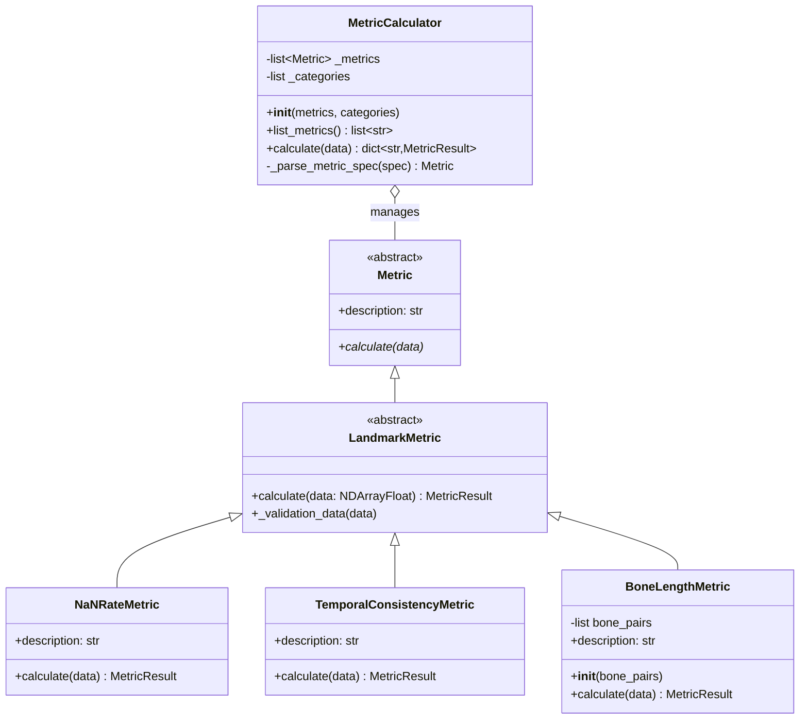
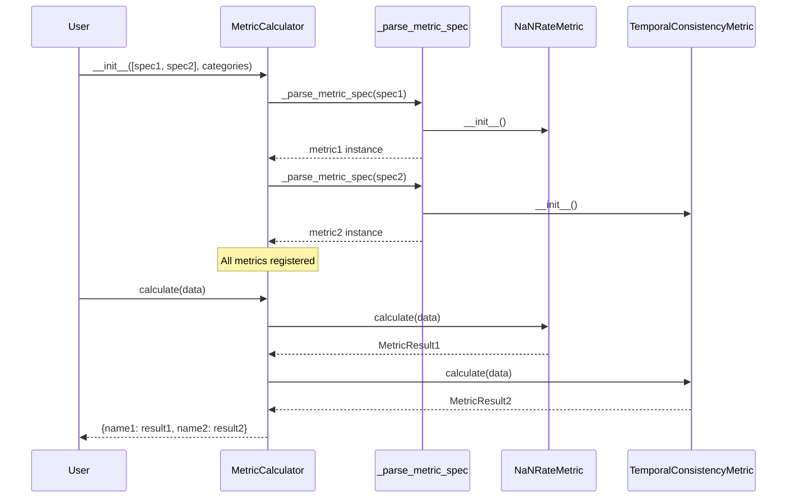
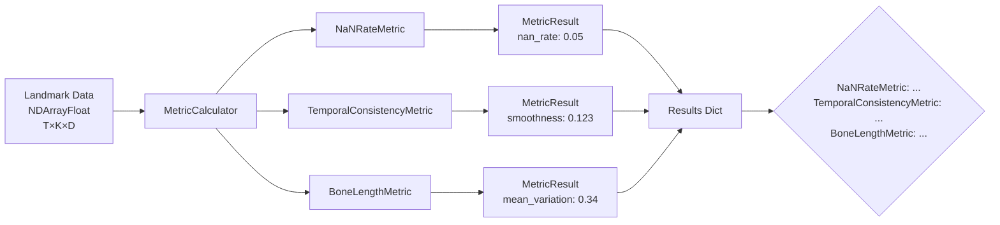
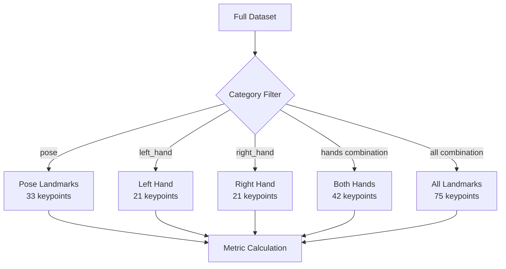

# MetricCalculator Architecture

## Overview

`MetricCalculator` is a flexible batch metric computation system that allows users to register and execute multiple metrics at once. It supports various metric specification formats for maximum convenience.

## Key Design Principles

1. **Constructor-time Registration**: All metrics are registered when creating the calculator (no separate `register()` method)
2. **No kwargs in calculate()**: Metrics use constructor parameters instead of runtime kwargs for Calculator compatibility
3. **Flexible Specification**: Support for instances, classes, and dictionary configurations
4. **Category-aware**: Optional category-based data filtering (prepared for future implementation)

## Architecture Diagram



## Metric Specification Formats

The calculator accepts three formats for metric specification:

### Format 1: Direct Instance

```python
calculator = MetricCalculator([
    NaNRateMetric(),
    TemporalConsistencyMetric(),
    BoneLengthMetric(bone_pairs=custom_bones),
])
```

**Use case**: When you need full control over metric initialization.

### Format 2: Class Reference (Bare)

```python
calculator = MetricCalculator([
    NaNRateMetric,  # Automatically instantiated with no args
    TemporalConsistencyMetric,
])
```

**Use case**: Simple metrics without constructor parameters.

### Format 3: Dictionary Configuration

```python
calculator = MetricCalculator([
    {
        "method": NaNRateMetric,
        "categories": ["pose", "left_hand"],
    },
    {
        "method": BoneLengthMetric,
        "bone_pairs": MEDIAPIPE_POSE_BONES,  # Constructor parameter
    },
])
```

**Use case**: When combining category filtering with custom parameters.

## Workflow Sequence



## Data Flow



Where:
- **T**: Number of frames
- **K**: Number of keypoints
- **D**: Coordinate dimensions (typically 3 for x, y, z)

## Usage Examples

### Basic Usage

```python
from cslrtools2.sldataset.metrics.calculator import MetricCalculator
from cslrtools2.sldataset.metrics.methods import (
    completeness,
    temporal,
    anatomical,
)

# Create calculator
calculator = MetricCalculator([
    completeness.NaNRateMetric(),
    temporal.TemporalConsistencyMetric(),
    anatomical.BoneLengthMetric(),
])

# Calculate all metrics
import numpy as np
landmarks = np.random.rand(100, 33, 3).astype(np.float32)
results = calculator.calculate(landmarks)

# Access results
print(results['NaNRateMetric']['values']['nan_rate'])  # 0.05
print(results['TemporalConsistencyMetric']['values']['smoothness'])  # 0.123
```

### Advanced Usage with Categories

```python
default_categories = [
    "left_hand",
    "right_hand",
    "pose",
    {"hands": ["left_hand", "right_hand"]},
    {"all": ["left_hand", "right_hand", "pose"]},
]

calculator = MetricCalculator(
    [
        {
            "method": completeness.NaNRateMetric,
            "categories": ["pose", "left_hand"],
        },
        temporal.TemporalConsistencyMetric(),
        {
            "method": anatomical.BoneLengthMetric,
            "bone_pairs": anatomical.MEDIAPIPE_POSE_BONES,
        },
    ],
    categories=default_categories,
)
```

### Mixed Formats

```python
# All three formats can be mixed in one calculator
calculator = MetricCalculator([
    completeness.NaNRateMetric(),  # Format 1: Direct instance
    temporal.TemporalConsistencyMetric,  # Format 2: Class reference
    {  # Format 3: Dictionary
        "method": anatomical.BoneLengthMetric,
        "bone_pairs": custom_bones,
    },
])
```

## Type Safety

The calculator uses Python type hints for safety:

```python
MetricSpec = Union[
    Metric,           # Direct instance
    type[Metric],     # Class reference
    dict[str, Any],   # Dict with "method" key
]

class MetricCalculator:
    def __init__(
        self,
        metrics: list[MetricSpec],
        categories: list[str | dict[str, list[str]]] | None = None,
    ) -> None: ...
    
    def calculate(self, data: NDArrayFloat) -> dict[str, MetricResult]: ...
```

## Category System (Design)

The category system allows filtering and combining landmark data:



### Category Types

1. **Simple Category**: `"pose"`, `"left_hand"`, `"right_hand"`
   - Selects a single landmark group

2. **Named Combination**: `{"hands": ["left_hand", "right_hand"]}`
   - Combines multiple categories with a name
   - Results stored under the combination name

3. **Special References**:
   - `"$default_categories"`: Reference to default categories
   - `"*default_categories"`: Expand default categories inline

## Error Handling

```python
# Invalid metric specification
try:
    calculator = MetricCalculator([
        "invalid_spec"  # Not a Metric, type[Metric], or dict
    ])
except ValueError as e:
    print(f"Error: {e}")
    # "Invalid metric specification: invalid_spec"

# Missing "method" key in dict
try:
    calculator = MetricCalculator([
        {"categories": ["pose"]}  # Missing "method"
    ])
except ValueError as e:
    print(f"Error: {e}")
    # "Dictionary metric specification must contain 'method' key"

# Cannot pass params to instance
try:
    calculator = MetricCalculator([
        {
            "method": NaNRateMetric(),  # Already instantiated
            "some_param": 123,  # Cannot override
        }
    ])
except ValueError as e:
    print(f"Error: {e}")
    # "Cannot pass constructor params when method is already an instance"
```

## Comparison with Prototype

### Prototype v2 (metrics_prototype2/loader.py)

```python
# Old pattern: register() method
calculator = MetricCalculator()
calculator.add_metric("completeness.nan_rate")
calculator.add_metric("temporal.smoothness", window=5)

results = calculator.calculate(data)
```

**Issues**:
- Requires entry point registration
- String-based lookup fragile
- Separate registration step
- Runtime kwargs in calculate()

### Production (calculator.py)

```python
# New pattern: constructor-time registration
calculator = MetricCalculator([
    completeness.NaNRateMetric(),
    {
        "method": temporal.TemporalConsistencyMetric,
        "window": 5,  # Constructor parameter
    },
])

results = calculator.calculate(data)  # No kwargs
```

**Improvements**:
- ✅ Direct class/instance references (type-safe)
- ✅ All registration at construction time
- ✅ No entry points required for built-in metrics
- ✅ No kwargs in calculate() (Calculator compatible)
- ✅ Constructor parameters instead of runtime kwargs

## Extension Points

### Custom Metrics

Users can create custom metrics by inheriting from `LandmarkMetric`:

```python
from cslrtools2.sldataset.metrics.methods.base import (
    LandmarkMetric,
    MetricResult,
)

class CustomMetric(LandmarkMetric):
    def __init__(self, threshold: float = 0.5):
        self.threshold = threshold
    
    @property
    def description(self) -> str:
        return f"Custom metric with threshold={self.threshold}"
    
    def calculate(self, data: NDArrayFloat) -> MetricResult:
        # Custom calculation
        value = float(np.mean(data > self.threshold))
        
        return MetricResult(
            name="custom_metric",
            values={"threshold_ratio": value},
            metadata={"threshold": self.threshold},
        )

# Use in calculator
calculator = MetricCalculator([
    CustomMetric(threshold=0.7),
])
```

### External Plugins (Future)

For external packages, entry points can still be used:

```toml
# pyproject.toml of external package
[project.entry-points."cslrtools2.sldataset.metrics"]
"custom.my_metric" = "my_package.metrics:MyMetric"
```

Then discovered via:
```python
from cslrtools2.sldataset.metrics.loader import load_metrics

# Future implementation
metrics = load_metrics()
calculator = MetricCalculator([
    metrics["custom.my_metric"],
])
```

## Performance Considerations

1. **Metric Instantiation**: Done once at constructor time
2. **Calculate Loop**: Sequential execution (parallel execution possible in future)
3. **Memory**: All metrics share the same input data (no copying)

## Future Enhancements

1. **Category Implementation**: Full category filtering system
2. **Parallel Execution**: Concurrent metric calculation for large datasets
3. **Result Caching**: Cache results for repeated calculations
4. **Progress Reporting**: Progress bars for long-running calculations
5. **Result Persistence**: Save/load results to/from disk
6. **Metric Aliases**: Short names like "nan_rate" instead of full class names

## See Also

- [Base Classes](methods/base.py) - Abstract base classes for metrics
- [Completeness Metrics](methods/completeness/) - Data quality metrics
- [Temporal Metrics](methods/temporal/) - Motion smoothness metrics
- [Anatomical Metrics](methods/anatomical/) - Physical plausibility metrics
- [Demo Usage](demo.py) - Example usage patterns
