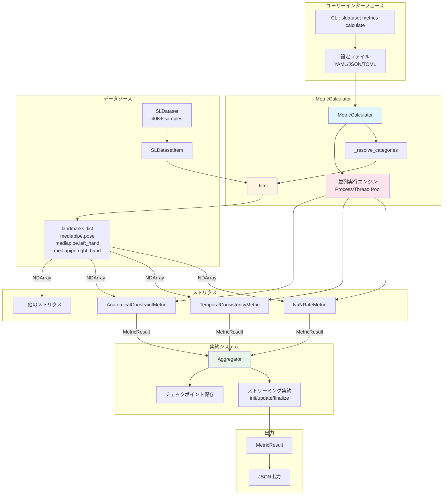
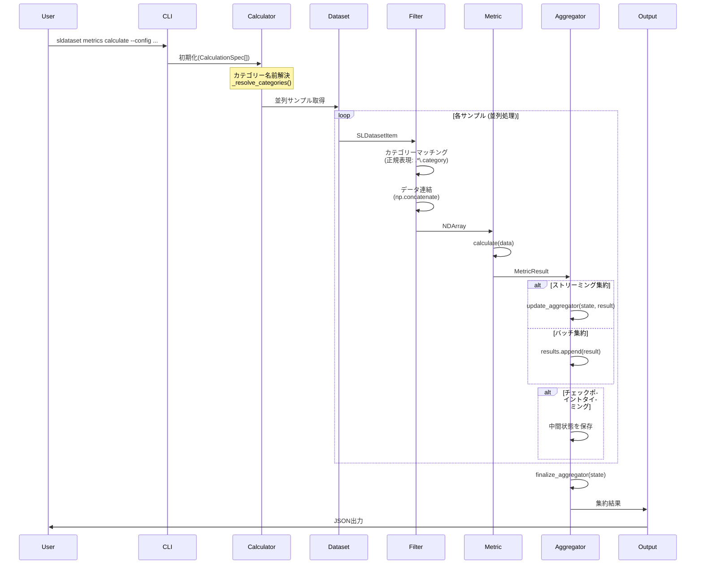
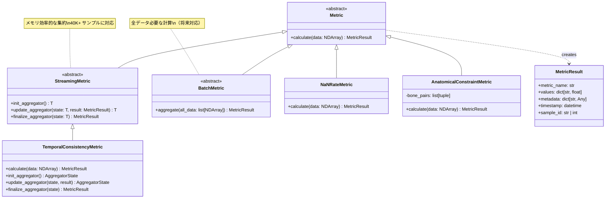
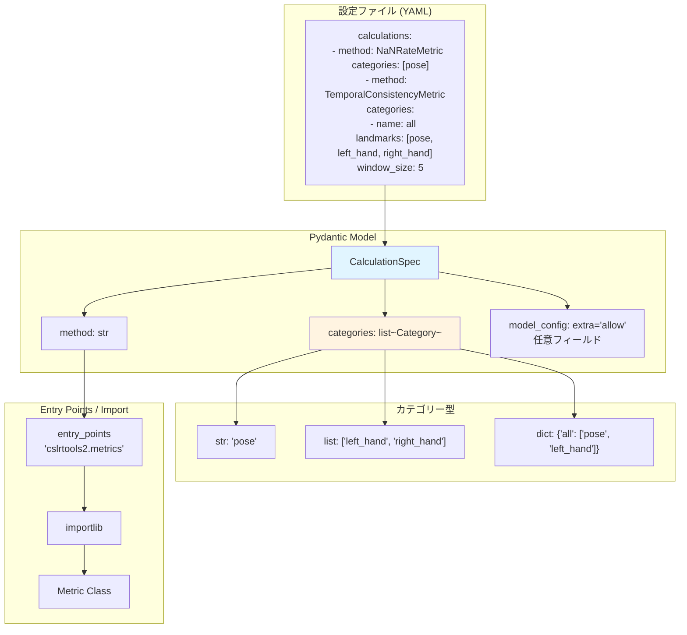
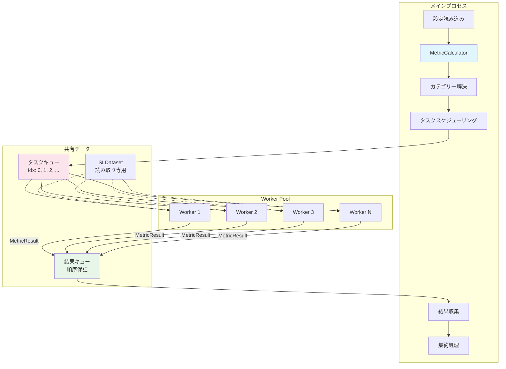
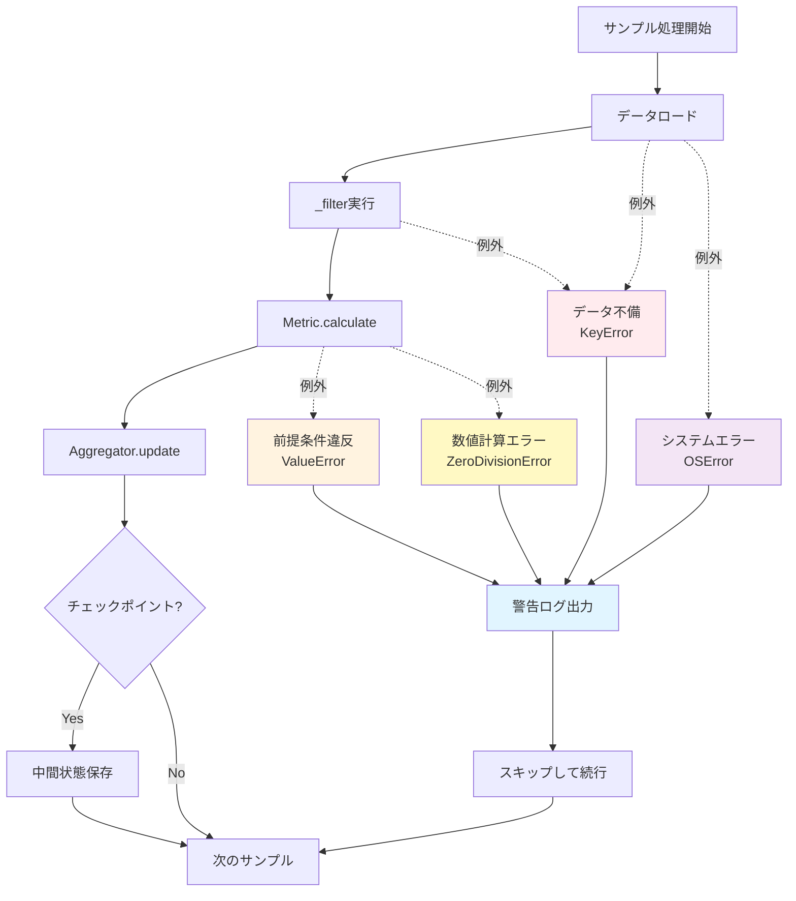
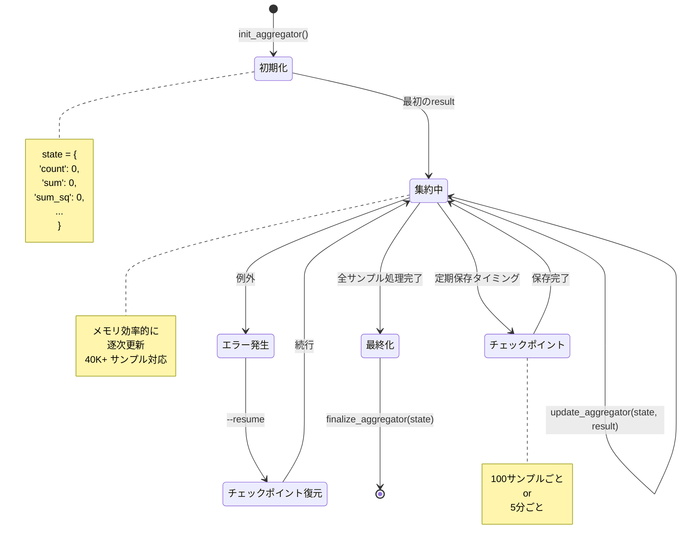
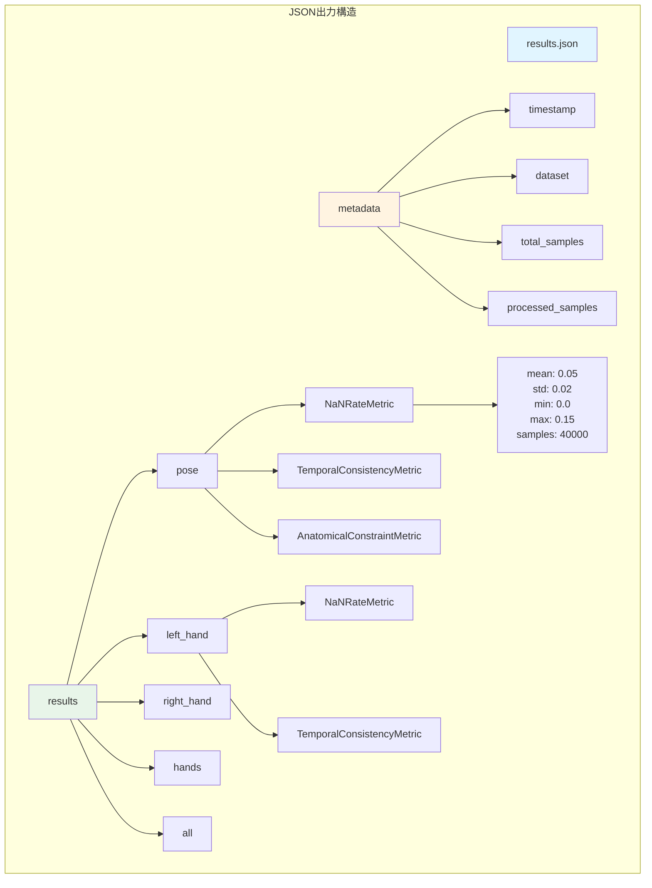
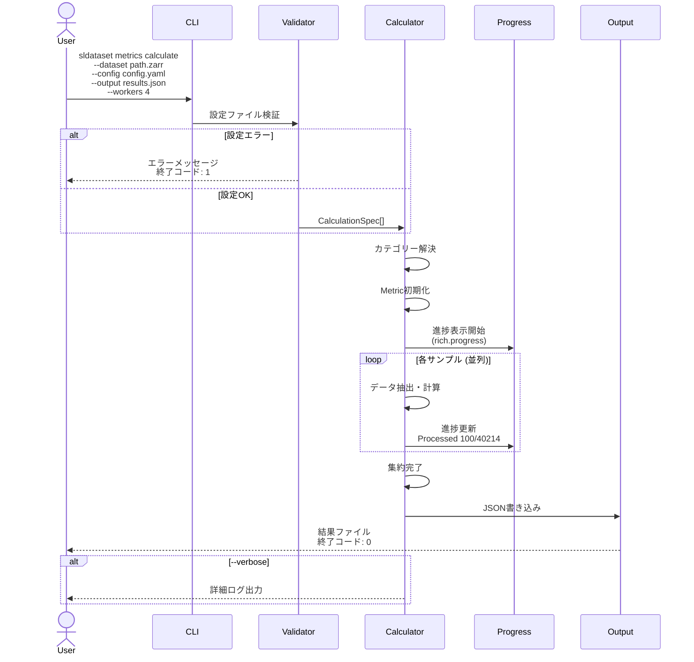
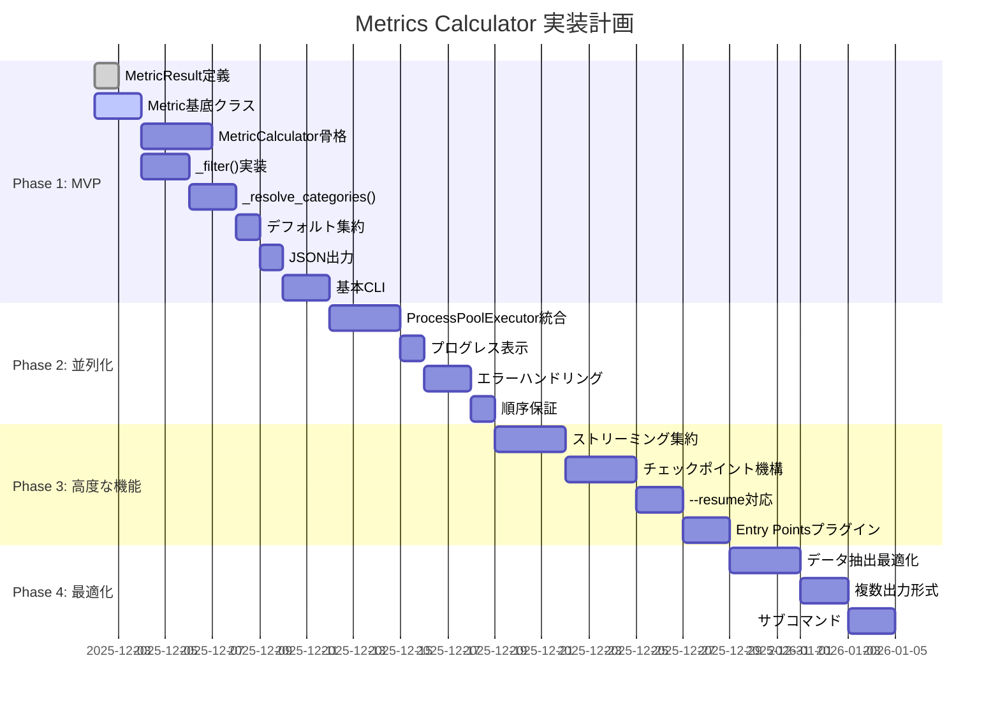

# Metrics Calculator 設計概要

## システム全体像



## データフロー詳細



## カテゴリーシステム

```mermaid
graph LR
    subgraph "カテゴリー定義"
        STR[単一カテゴリー<br/>'pose']
        LIST[無名組み合わせ<br/>['left_hand', 'right_hand']]
        DICT[名前付き組み合わせ<br/>{hands: ['left_hand', 'right_hand']}]
    end
    
    subgraph "名前解決"
        GLOBAL[グローバル定義<br/>category_definitions]
        LOCAL[ローカル定義<br/>calculation内]
        RESOLVE[_resolve_categories<br/>前方参照・循環検出]
    end
    
    subgraph "ランドマークマッチング"
        REGEX[正規表現<br/>'.*\.{category}']
        PRIORITY[プレフィックス優先度<br/>mediapipe > openpose]
        KEY[ランドマークキー<br/>'mediapipe.pose']
    end
    
    subgraph "データ抽出"
        ITEM[SLDatasetItem.landmarks]
        LOAD[zarr Array [()]ロード]
        CONCAT[複数カテゴリー結合<br/>np.concatenate]
        NDARRAY[NDArray<br/>(frames, keypoints, coords)]
    end
    
    STR --> RESOLVE
    LIST --> RESOLVE
    DICT --> RESOLVE
    GLOBAL --> RESOLVE
    LOCAL --> RESOLVE
    
    RESOLVE --> REGEX
    REGEX --> PRIORITY
    PRIORITY --> KEY
    
    KEY --> ITEM
    ITEM --> LOAD
    LOAD --> CONCAT
    CONCAT --> NDARRAY
    
    style RESOLVE fill:#fff4e1
    style CONCAT fill:#e8f5e9
```

## Metricインターフェース階層



## CalculationSpec構造



## 並列処理アーキテクチャ



## エラーハンドリングフロー



## 集約システム



## 出力フォーマット構造



## CLI実行フロー



## 実装ロードマップ



---

## 設計原則まとめ

### 1. 責任分離
- **Calculator**: オーケストレーション、データ抽出
- **Metric**: 計算ロジックのみ
- **Aggregator**: 集約処理

### 2. 柔軟性
- YAML/JSON/TOML + Python両対応
- Entry Pointsプラグインシステム
- ストリーミング/バッチ両対応

### 3. 効率性
- サンプル並列処理（40K+対応）
- ストリーミング集約（メモリ効率）
- チェックポイント機構（エラー回復）

### 4. 拡張性
- プラグインシステム
- 複数出力形式
- カスタムメトリクス追加容易

---

**生成日**: 2025-12-02  
**ステータス**: 設計確定、実装準備中  
**関連ドキュメント**: `metrics_calc_memo.md` (詳細Q&A記録)
