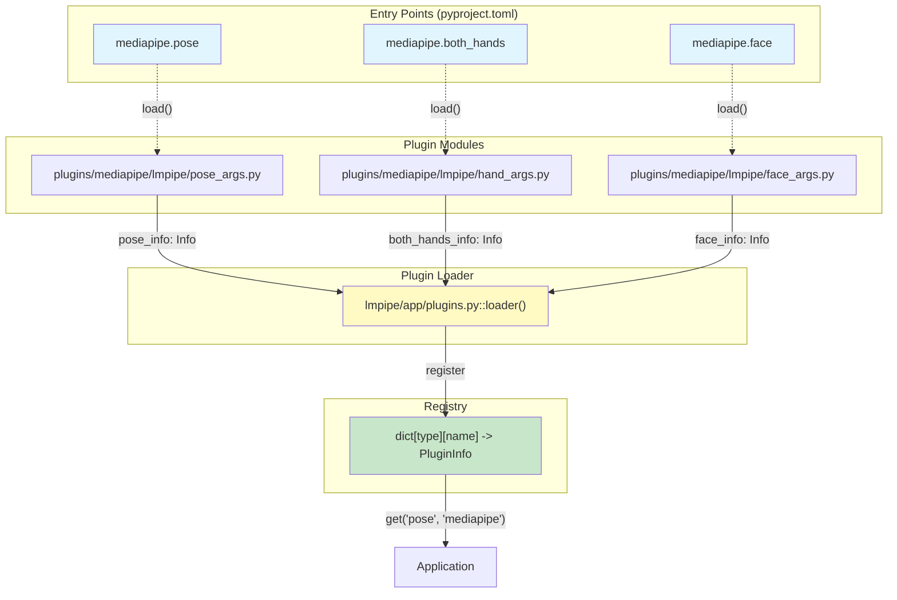
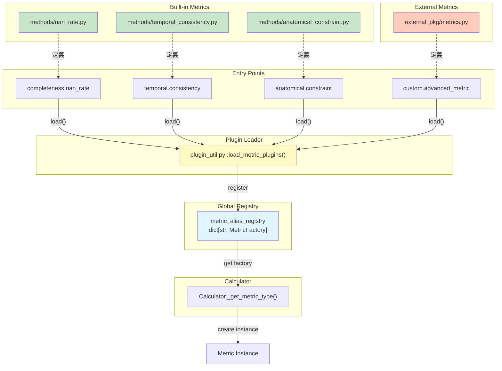

# Metrics Plugin Strategy Discussion

**作成日**: 2025-12-09  
**更新日**: 2025-12-09  
**目的**: cslrtools2の既存プラグイン戦略を参考に、`sldataset.metrics` のプラグイン登録戦略を設計

---

## 🎯 設計目標

1. **ビルトインメトリクスもプラグインで登録**: 内部・外部で統一された登録メカニズム
2. **Factory関数形式**: 設定に基づいてメトリクスインスタンスを生成
3. **型階層のサポート**: `"completeness.nan_rate"` のような階層的な名前空間
4. **拡張性**: サードパーティパッケージでの追加メトリクス定義をサポート

---

## 📋 既存プラグイン戦略の分析

### 1. lmpipe のプラグイン戦略

#### アーキテクチャ図



#### 構造

```
src/cslrtools2/
├── lmpipe/
│   └── app/
│       └── plugins.py          # プラグインローダー
├── plugins/
│   └── mediapipe/
│       └── lmpipe/
│           ├── pose_args.py    # pose_info をエクスポート
│           ├── hand_args.py    # both_hands_info, left_hand_info, etc.
│           ├── face_args.py
│           └── holistic_args.py
```

#### Entry Point (pyproject.toml)

```toml
[project.entry-points."cslrtools2.lmpipe.plugins"]
"mediapipe.pose" = "cslrtools2.plugins.mediapipe.lmpipe.pose_args:pose_info"
"mediapipe.both_hands" = "cslrtools2.plugins.mediapipe.lmpipe.hand_args:both_hands_info"
"mediapipe.left_hand" = "cslrtools2.plugins.mediapipe.lmpipe.hand_args:left_hand_info"
"mediapipe.right_hand" = "cslrtools2.plugins.mediapipe.lmpipe.hand_args:right_hand_info"
"mediapipe.face" = "cslrtools2.plugins.mediapipe.lmpipe.face_args:face_info"
"mediapipe.holistic" = "cslrtools2.plugins.mediapipe.lmpipe.holistic_args:holistic_info"
```

#### プラグイン情報の型

```python
# lmpipe/app/plugins.py
type Info[T, K: str] = tuple[NamespaceWrapper[T], _EstimatorCreator[T, K]]

class PluginInfo[T, K: str](TypedDict):
    name: str
    type: str
    nswrapper: NamespaceWrapper[T]
    creator: _EstimatorCreator[T, K]  # Callable[[T], Estimator[K]]
```

#### プラグイン定義例

```python
# plugins/mediapipe/lmpipe/pose_args.py
@namespace
class MediaPipePoseArgs(MediaPipeBaseArgs, mixin.ReprMixin):
    pose_model: Literal["lite", "full", "heavy"] = "full"
    min_pose_detection_confidence: float = 0.0
    # ...

def get_pose_estimator(ns: MediaPipePoseArgs.T):
    from .pose import MediaPipePoseEstimator
    return MediaPipePoseEstimator(ns)

pose_info: Info[MediaPipePoseArgs.T, MediaPipePoseKey] = (
    MediaPipePoseArgs,
    get_pose_estimator,
)
```

#### ローダー（参考: lmpipe）

```python
# lmpipe/app/plugins.py
def loader() -> dict[str, dict[str, PluginInfo[Any, Any]]]:
    entry_points = importlib.metadata.entry_points(group="cslrtools2.lmpipe.plugins")
    
    plugins: dict[str, dict[str, PluginInfo[Any, Any]]] = {}
    
    for ep in entry_points:
        info = ep.load()  # tuple[NamespaceWrapper, EstimatorCreator]
        
        # Validation
        nswrapper, creator = info
        
        name_, type_ = ep.name.rsplit(".", 1)  # "mediapipe.pose" -> ("mediapipe", "pose")
        
        plugins.setdefault(type_, {})[name_] = PluginInfo(
            name=name_, type=type_, nswrapper=nswrapper, creator=creator
        )
    
    return plugins
```

**戻り値の構造**:
```python
{
    "pose": {
        "mediapipe": PluginInfo(...),
    },
    "both_hands": {
        "mediapipe": PluginInfo(...),
    },
    # ...
}
```

---

## 🔌 外部パッケージでのメトリクス拡張例

サードパーティパッケージが新しいメトリクスを追加する例です。

### 外部パッケージの構造

```
external-metrics-pkg/
├── pyproject.toml
└── src/
    └── external_metrics/
        ├── __init__.py
        └── advanced_metric.py
```

### pyproject.toml

```toml
[project]
name = "external-metrics-pkg"
version = "0.1.0"
dependencies = ["cslrtools2"]

[project.entry-points."cslrtools2.sldataset.metrics"]
"custom.advanced_metric" = "external_metrics.advanced_metric:metric_info"
"custom.another_metric" = "external_metrics.another_metric:metric_info"
```

### advanced_metric.py

```python
# external_metrics/advanced_metric.py
from __future__ import annotations

from typing import Any, Mapping

import numpy as np
from cslrtools2.sldataset.metrics.metric import Metric, CategoryGroup
from cslrtools2.sldataset.metrics.schema import MetricSpec
from cslrtools2.sldataset.metrics.stat import StatResult
from cslrtools2.sldataset.metrics.plugin_util import MetricInfo


class AdvancedMetric(Metric):
    """External advanced metric implementation."""

    def get_cli_description(self) -> str:
        return "Advanced custom metric from external package"

    def calculate(
        self,
        category_group: CategoryGroup,
        stats: StatResult,
        data: np.ndarray
    ) -> Mapping[str, Any]:
        # Custom implementation
        advanced_score = self._compute_advanced_score(data)
        
        return {
            "advanced_score": advanced_score,
            "custom_field": 42
        }
    
    def _compute_advanced_score(self, data: np.ndarray) -> float:
        # Complex computation
        return float(np.mean(data))


def create_advanced_metric(spec: MetricSpec) -> Metric:
    """Factory function for AdvancedMetric."""
    return AdvancedMetric(spec)


# Plugin info
metric_info: MetricInfo = (None, create_advanced_metric)
```

### 使用例

```python
# User's configuration (YAML)
calculator:
  metrics:
    my_advanced_metric:
      type: custom.advanced_metric  # ← 外部パッケージのメトリクス
      targets:
        group: landmarks
        values:
          - pose
```

インストール後、自動的に `metric_alias_registry` に登録されます:

```python
# cslrtools2 内部で自動的に実行される
from cslrtools2.sldataset.metrics.plugin_util import metric_alias_registry

# 登録済みメトリクス
print(metric_alias_registry.keys())
# => ['completeness.nan_rate', 'temporal.consistency', 'custom.advanced_metric', ...]
```

---

### 2. sldataset のプラグイン戦略

#### 構造

```
src/cslrtools2/
├── sldataset/
│   └── app/
│       └── plugins.py          # プラグインローダー
├── plugins/
│   └── fluentsigners50/
│       └── sldataset/
│           └── __init__.py     # info をエクスポート
```

#### Entry Point (pyproject.toml)

```toml
[project.entry-points."cslrtools2.sldataset.plugins"]
"fs50" = "cslrtools2.plugins.fluentsigners50.sldataset:info"
```

#### プラグイン情報の型

```python
# sldataset/app/plugins.py
type Info[T] = tuple[NamespaceWrapper[T], Callable[[T], None]]

class PluginInfo[T](TypedDict):
    name: str
    nswrapper: NamespaceWrapper[T]
    processor: _Processor[T]  # Callable[[T], None]
```

#### プラグイン定義例

```python
# plugins/fluentsigners50/sldataset/__init__.py
@namespace
class FS50Args(mixin.ReprMixin):
    origin: Path
    processed: Path
    output: Path
    use_zip: bool = False

def processor(args: FS50Args.T):
    from ....sldataset.dataset import dataset_to_zarr
    from .main import load
    
    dataset = load(origin=args.origin, processed=args.processed)
    # ... convert to zarr

info: Info[FS50Args.T] = (FS50Args, processor)
```

#### ローダー

```python
# sldataset/app/plugins.py
def loader() -> dict[str, PluginInfo[Any]]:
    entry_points = importlib.metadata.entry_points(group="cslrtools2.sldataset.plugins")
    
    plugins: dict[str, PluginInfo[Any]] = {}
    
    for ep in entry_points:
        info = ep.load()  # tuple[NamespaceWrapper, Processor]
        
        # Validation
        nswrapper, processor = info
        
        plugins[ep.name] = PluginInfo(
            name=ep.name, nswrapper=nswrapper, processor=processor
        )
    
    return plugins
```

**戻り値の構造**:
```python
{
    "fs50": PluginInfo(...),
    # ...
}
```

---

## 🔤 Entry Point Name (ep.name) 形式の候補

メトリクスプラグインの Entry Point 名の形式を検討します。

### 候補1: 型階層あり（ドット区切り）

**形式**: `"<category>.<metric_name>"`

**例**:
```toml
[project.entry-points."cslrtools2.sldataset.metrics"]
"completeness.nan_rate" = "cslrtools2.sldataset.metrics.methods.nan_rate:metric_info"
"temporal.consistency" = "cslrtools2.sldataset.metrics.methods.temporal_consistency:metric_info"
"anatomical.constraint" = "cslrtools2.sldataset.metrics.methods.anatomical_constraint:metric_info"
```

**メリット**:
- カテゴリ別にメトリクスを整理できる
- `type` と `name` に分割可能: `"completeness.nan_rate"` → `("completeness", "nan_rate")`
- 名前空間の衝突を防ぐ

**デメリット**:
- 名前が長くなる

---

### 候補2: フラット（アンダースコア区切り）

**形式**: `"<metric_name>"`

**例**:
```toml
[project.entry-points."cslrtools2.sldataset.metrics"]
"nan_rate" = "cslrtools2.sldataset.metrics.methods.nan_rate:metric_info"
"temporal_consistency" = "cslrtools2.sldataset.metrics.methods.temporal_consistency:metric_info"
"anatomical_constraint" = "cslrtools2.sldataset.metrics.methods.anatomical_constraint:metric_info"
```

**メリット**:
- シンプルで短い
- タイプしやすい

**デメリット**:
- カテゴリ情報がない
- 名前空間の衝突リスク

---

### 候補3: ベンダープレフィックス + 型階層

**形式**: `"<vendor>.<category>.<metric_name>"`

**例**:
```toml
[project.entry-points."cslrtools2.sldataset.metrics"]
"cslrtools2.completeness.nan_rate" = "cslrtools2.sldataset.metrics.methods.nan_rate:metric_info"
"external_pkg.custom.advanced_metric" = "external_pkg.metrics:metric_info"
```

**メリット**:
- ベンダー/パッケージの明示
- 名前空間の衝突を完全に防ぐ
- 複数パッケージでの同名メトリクスをサポート

**デメリット**:
- 名前が非常に長い
- ビルトインメトリクスでベンダー名が冗長

---

### 推奨: **候補1 (型階層あり、ドット区切り)** ✅

**理由**:
1. **カテゴリ情報の保持**: メトリクスの分類が明確
2. **適度な名前空間分離**: 同名メトリクスの衝突を防ぐ
3. **既存パターンとの一貫性**: lmpipe の `"mediapipe.pose"` と同じ形式
4. **解析が容易**: `ep.name.rsplit(".", 1)` で簡単に分割可能

**採用する形式**:
```
"<category>.<metric_name>"

例:
- completeness.nan_rate
- temporal.consistency
- anatomical.constraint
- custom.advanced_metric  (外部パッケージ)
```

---

## 🎯 metrics プラグイン戦略の設計

### 統一戦略: Factory関数形式 + 型階層

**重要な変更**: ビルトインメトリクスも Entry Point で登録し、内部・外部で統一された仕組みを使用します。



### プラグイン情報の型定義

```python
# src/cslrtools2/sldataset/metrics/plugin_util.py
from typing import Callable, TypedDict
from .metric import Metric
from .schema import MetricSpec

# Factory function type: creates Metric instance from spec
type MetricFactory = Callable[[MetricSpec], Metric]

# Plugin info structure (simplified, no namespace args)
type MetricInfo = tuple[None, MetricFactory]

class MetricPluginInfo(TypedDict):
    name: str           # "nan_rate"
    category: str       # "completeness"
    factory: MetricFactory
```

---

## 📦 ビルトインメトリクスの実装例

### Entry Point (pyproject.toml)

**ビルトインメトリクス**も Entry Point で登録します:

```toml
[project.entry-points."cslrtools2.sldataset.metrics"]
"completeness.nan_rate" = "cslrtools2.sldataset.metrics.methods.nan_rate:metric_info"
"temporal.consistency" = "cslrtools2.sldataset.metrics.methods.temporal_consistency:metric_info"
"anatomical.constraint" = "cslrtools2.sldataset.metrics.methods.anatomical_constraint:metric_info"
```

### メトリクスモジュールの実装

#### methods/nan_rate.py

```python
# Copyright 2025 cslrtools2 contributors
# ...

from __future__ import annotations

from typing import Any, Mapping

import numpy as np

from ..stat import StatResult
from ..metric import CategoryGroup, Metric
from ..schema import MetricSpec
from ..plugin_util import MetricInfo


class NaNRateMetric(Metric):
    """Calculates the rate of NaN values in the dataset."""

    def get_cli_description(self) -> str:
        return "Calculates the rate of NaN values in the dataset."

    def get_cli_detail(self) -> str:
        return (
            "The NaN Rate Metric computes the proportion of "
            "NaN (Not a Number) values present in the dataset."
        )

    def calculate(
        self,
        category_group: CategoryGroup,
        stats: StatResult,
        data: np.ndarray
    ) -> Mapping[str, Any]:
        """Calculate NaN rate.
        
        Args:
            category_group: Category group (e.g., "landmarks")
            stats: Statistics result
            data: Landmark data with shape [T, V, C]
        
        Returns:
            Dictionary with 'nan_rate' and 'frames_with_nan' keys
        """
        frame_has_nan: np.ndarray = np.any(
            np.isnan(data),
            axis=(1, 2)
        )

        nan_rate = float(np.mean(frame_has_nan))
        frames_with_nan = int(np.sum(frame_has_nan))

        return {
            "nan_rate": nan_rate,
            "frames_with_nan": frames_with_nan
        }


def create_nan_rate_metric(spec: MetricSpec) -> Metric:
    """Factory function for NaNRateMetric.
    
    Args:
        spec: Metric specification from configuration
    
    Returns:
        Initialized NaNRateMetric instance
    """
    return NaNRateMetric(spec)


# Plugin info: tuple of (None, factory_function)
metric_info: MetricInfo = (None, create_nan_rate_metric)
```

**重要なポイント**:
- **Factory関数**: `create_nan_rate_metric()` が `MetricSpec` からインスタンスを生成
- **Plugin info**: `(None, factory)` のタプル形式（lmpipe の `Info` と同じパターン）
- **Entry Point**: `"completeness.nan_rate"` という階層的な名前

#### ローダー

```python
# src/cslrtools2/sldataset/metrics/plugin_util.py
from typing import Callable, TypedDict, Any
import importlib.metadata
from .metric import Metric
from .schema import MetricSpec

type MetricCreator = Callable[[MetricSpec], Metric]

class MetricPluginInfo(TypedDict):
    name: str
    type: str  # "completeness", "temporal", etc.
    creator: MetricCreator

def load_metric_plugins() -> dict[str, dict[str, MetricPluginInfo]]:
    """Load metric plugins from entry points.
    
    Returns:
        Dictionary mapping type -> name -> MetricPluginInfo.
        
        Example:
            {
                "completeness": {
                    "nan_rate": MetricPluginInfo(...),
                },
                "temporal": {
                    "consistency": MetricPluginInfo(...),
                },
            }
    """
    entry_points = importlib.metadata.entry_points(
        group="cslrtools2.sldataset.metrics"
    )
    
    plugins: dict[str, dict[str, MetricPluginInfo]] = {}
    
    for ep in entry_points:
        info = ep.load()  # tuple[None, MetricCreator] or tuple
        
        if isinstance(info, tuple) and len(info) == 2:
            _, creator = info
        else:
            # Fallback: assume it's the creator directly
            creator = info
        
        # Parse name: "completeness.nan_rate" -> ("completeness", "nan_rate")
        parts = ep.name.rsplit(".", 1)
        if len(parts) == 2:
            type_, name_ = parts
        else:
            type_ = "default"
            name_ = ep.name
        
        plugins.setdefault(type_, {})[name_] = MetricPluginInfo(
            name=name_,
            type=type_,
            creator=creator,
        )
    
    return plugins

# Initialize global registry
def initialize_metric_alias_registry():
    """Initialize metric_alias_registry from plugins."""
    from .plugin_util import metric_alias_registry
    
    plugins = load_metric_plugins()
    
    for type_, type_plugins in plugins.items():
        for name_, plugin_info in type_plugins.items():
            # Register as "completeness.nan_rate"
            full_name = f"{type_}.{name_}"
            metric_alias_registry[full_name] = plugin_info["creator"]
```

---

## 🔧 プラグインローダーの実装

### plugin_util.py (完全版)

```python
# Copyright 2025 cslrtools2 contributors
# ...

from __future__ import annotations

import importlib.metadata
from typing import TYPE_CHECKING, Callable

from ..logger import sldataset_logger

if TYPE_CHECKING:
    from .metric import Metric
    from .schema import MetricSpec


# Type aliases
type MetricFactory = Callable[[MetricSpec], Metric]
type MetricInfo = tuple[None, MetricFactory]

# Global metric registry: "category.metric_name" -> factory function
metric_alias_registry: dict[str, MetricFactory] = {}


def load_metric_plugins() -> None:
    """Load all metric plugins from entry points.
    
    This function loads both built-in and external metrics via the
    'cslrtools2.sldataset.metrics' entry point group.
    
    Entry point format:
        [project.entry-points."cslrtools2.sldataset.metrics"]
        "completeness.nan_rate" = "package.module:metric_info"
    
    Each entry point should export a `metric_info: MetricInfo` tuple
    containing (None, factory_function).
    """
    entry_points = importlib.metadata.entry_points(
        group="cslrtools2.sldataset.metrics"
    )
    
    loaded_count = 0
    
    for ep in entry_points:
        try:
            # Load plugin info
            info = ep.load()
            
            # Validation
            if not isinstance(info, tuple) or len(info) != 2:
                sldataset_logger.error(
                    f"Plugin entry point '{ep.name}' does not return a "
                    f"tuple of length 2. Got {type(info)}"
                )
                continue
            
            _, factory = info
            
            if not callable(factory):
                sldataset_logger.error(
                    f"Plugin entry point '{ep.name}' factory is not callable. "
                    f"Got {type(factory)}"
                )
                continue
            
            # Register factory
            metric_alias_registry[ep.name] = factory
            
            sldataset_logger.debug(f"Loaded metric plugin: {ep.name}")
            loaded_count += 1
            
        except Exception as e:
            sldataset_logger.error(
                f"Failed to load metric plugin '{ep.name}': {e}",
                exc_info=True
            )
    
    sldataset_logger.info(
        f"Loaded {loaded_count} metric plugins from entry points"
    )


# Initialize on module load
load_metric_plugins()


__all__ = ["metric_alias_registry", "MetricFactory", "MetricInfo"]
```

### データフロー図

```mermaid
sequenceDiagram
    participant EP as Entry Points
    participant PU as plugin_util.py
    participant REG as metric_alias_registry
    participant CALC as Calculator
    participant METRIC as Metric Instance
    
    Note over EP: Module load時
    EP->>PU: importlib.metadata.entry_points()
    
    loop For each entry point
        PU->>EP: ep.load()
        EP-->>PU: (None, factory_function)
        PU->>PU: Validate factory
        PU->>REG: registry[ep.name] = factory
    end
    
    Note over CALC: 実行時
    CALC->>REG: get("completeness.nan_rate")
    REG-->>CALC: factory_function
    CALC->>CALC: factory(MetricSpec)
    CALC-->>METRIC: Metric instance
    METRIC->>METRIC: calculate(...)
    
    style EP fill:#e1f5fe
    style PU fill:#fff9c4
    style REG fill:#c8e6c9
```

---

## 🔗 Calculator との統合

### calculator.py の修正

```python
# calculator.py
from .plugin_util import metric_alias_registry, MetricFactory

class Calculator:
    @classmethod
    def _get_metric_type(
        cls,
        metric_type: str,
        config: CalculatorConfig
    ) -> MetricFactory:  # ← 戻り値の型を変更
        """Get metric factory function from registry.
        
        Args:
            metric_type: Metric type identifier (e.g., "completeness.nan_rate")
            config: Calculator configuration
        
        Returns:
            Factory function that creates Metric instance from MetricSpec
        
        Raises:
            KeyError: If metric type not found in registry
            NotImplementedError: If resolution mode not supported
        """
        factory = metric_alias_registry.get(metric_type, None)
        
        if factory is not None:
            return factory
        
        if config.metric_resolve_mode == MetricResolveMode.WHITE_LIST:
            raise KeyError(
                f"Metric type '{metric_type}' not found in white-list. "
                f"Available metrics: {list(metric_alias_registry.keys())}"
            )
        
        # TODO: Implement other resolution modes (e.g., FQCN, plugin discovery)
        sldataset_logger.warning(
            f"Metric type resolution mode '{config.metric_resolve_mode}' "
            f"not implemented. Falling back to WHITE_LIST mode for "
            f"metric '{metric_type}'."
        )
        raise NotImplementedError(
            f"Metric type resolution not implemented for mode "
            f"'{config.metric_resolve_mode}'. Metric: '{metric_type}'"
        )
    
    @classmethod
    def from_config(
        cls,
        metric_specs: Mapping[str, MetricSpec],
        common_spec: CommonMetricSpec,
        config: CalculatorConfig
    ) -> Self:
        metrics: dict[str, MetricEntry] = {}
        
        for metric_ident, metric_spec in metric_specs.items():
            # ... spec merging ...
            
            # Get factory function
            metric_factory = cls._get_metric_type(
                merged_spec.type,
                config
            )
            
            # Create metric instance using factory
            metric = metric_factory(merged_spec)  # ← Factory呼び出し
            
            category_group, category_values = cls._normalize_target(
                merged_spec.targets
            )
            
            metrics[metric_ident] = MetricEntry(
                metric_spec=merged_spec,
                metric_instance=metric,
                category_group=category_group,
                category_values=category_values
            )
        
        return cls(metrics)
```

**重要な変更点**:
1. `_get_metric_type()` の戻り値が `type[Metric]` → `MetricFactory` に変更
2. Factory 関数を呼び出してインスタンスを生成: `metric_factory(merged_spec)`
3. `metric_alias_registry` の型が `dict[str, MetricFactory]` に変更

---

## ✅ 実装チェックリスト

### Phase 1: plugin_util.py の実装

- [ ] `plugin_util.py` ファイルを作成
  - パス: `src/cslrtools2/sldataset/metrics/plugin_util.py`
  
- [ ] 型エイリアスを定義
  ```python
  type MetricFactory = Callable[[MetricSpec], Metric]
  type MetricInfo = tuple[None, MetricFactory]
  ```

- [ ] グローバルレジストリを定義
  ```python
  metric_alias_registry: dict[str, MetricFactory] = {}
  ```

- [ ] `load_metric_plugins()` 関数を実装
  - Entry point グループ: `"cslrtools2.sldataset.metrics"`
  - バリデーション: tuple形式、callable検証
  - エラーハンドリング: ロガー統合

- [ ] モジュールロード時に自動初期化
  ```python
  load_metric_plugins()
  ```

### Phase 2: 既存メトリクスのファクトリ関数化

- [ ] `methods/nan_rate.py` を修正
  - [ ] `create_nan_rate_metric(spec: MetricSpec) -> Metric` を実装
  - [ ] `metric_info: MetricInfo = (None, create_nan_rate_metric)` をエクスポート
  - [ ] 既存の `NaNRateMetric` クラスを保持（factory内で使用）

- [ ] `methods/temporal_consistency.py` を修正（同様の変更）

- [ ] `methods/anatomical_constraint.py` を修正（同様の変更）

### Phase 3: pyproject.toml の Entry Point 追加

- [ ] ビルトインメトリクスの Entry Point を追加
  ```toml
  [project.entry-points."cslrtools2.sldataset.metrics"]
  "completeness.nan_rate" = "cslrtools2.sldataset.metrics.methods.nan_rate:metric_info"
  "temporal.consistency" = "cslrtools2.sldataset.metrics.methods.temporal_consistency:metric_info"
  "anatomical.constraint" = "cslrtools2.sldataset.metrics.methods.anatomical_constraint:metric_info"
  ```

### Phase 4: calculator.py の修正

- [ ] `_get_metric_type()` の戻り値型を変更
  ```python
  def _get_metric_type(...) -> MetricFactory:  # 旧: type[Metric]
  ```

- [ ] `from_config()` でファクトリ呼び出しに変更
  ```python
  metric_factory = cls._get_metric_type(...)
  metric = metric_factory(merged_spec)  # 旧: metric = metric_cls(merged_spec)
  ```

### Phase 5: テスト

- [ ] プラグインロードのユニットテスト
  - `tests/unit/sldataset/metrics/test_plugin_util.py`
  
- [ ] ファクトリ関数のテスト
  - 各メトリクスのファクトリ関数が正しく動作するか
  
- [ ] 統合テスト
  - `Calculator.from_config()` が正しく動作するか
  - Entry Point 経由でメトリクスがロードされるか

### Phase 6: ドキュメント更新

- [ ] API ドキュメント
  - `docs/api/sldataset.md` に plugin_util.py の説明を追加
  
- [ ] 外部パッケージ開発者向けガイド
  - メトリクス拡張方法の説明
  - `external-metrics-pkg` サンプルコードの追加

### Phase 7: 外部プラグインサポート（オプション）

3. **`plugin_util.py` に外部プラグインローダーを追加**
   ```python
   import importlib.metadata
   
   def load_external_metric_plugins():
       entry_points = importlib.metadata.entry_points(
           group="cslrtools2.sldataset.metrics"
       )
       
       for ep in entry_points:
           metric_cls = ep.load()
           
           if not isinstance(metric_cls, type) or not issubclass(metric_cls, Metric):
               raise TypeError(...)
           
           metric_alias_registry[ep.name] = metric_cls
   
   load_external_metric_plugins()
   ```

4. **外部プラグインの例 (サードパーティ)**
   ```toml
   # external-package/pyproject.toml
   [project.entry-points."cslrtools2.sldataset.metrics"]
   "custom.advanced_metric" = "external_package.metrics:AdvancedMetric"
   ```

### Phase 3: テスト

5. **ユニットテスト**
   - `test_plugin_util.py`: 内部メトリクス登録のテスト
   - `test_external_plugins.py`: 外部プラグインのロードテスト

---

## 🔧 実装例

### plugin_util.py (完全版)

```python
# Copyright 2025 cslrtools2 contributors
# ...

from __future__ import annotations

import importlib.metadata
from typing import TYPE_CHECKING

from ..logger import sldataset_logger

if TYPE_CHECKING:
    from .metric import Metric


# Global metric registry
metric_alias_registry: dict[str, type[Metric]] = {}


def register_builtin_metrics() -> None:
    """Register built-in metrics to the global registry.
    
    This function is called automatically on module load.
    """
    from .methods.nan_rate import NaNRateMetric
    from .methods.temporal_consistency import TemporalConsistencyMetric
    from .methods.anatomical_constraint import AnatomicalConstraintMetric
    
    metric_alias_registry["completeness.nan_rate"] = NaNRateMetric
    metric_alias_registry["temporal.consistency"] = TemporalConsistencyMetric
    metric_alias_registry["anatomical.constraint"] = AnatomicalConstraintMetric
    
    sldataset_logger.debug(
        f"Registered {len(metric_alias_registry)} built-in metrics"
    )


def load_external_metric_plugins() -> None:
    """Load external metric plugins from entry points.
    
    This function is called automatically on module load.
    External plugins should be registered via:
    
        [project.entry-points."cslrtools2.sldataset.metrics"]
        "custom.my_metric" = "my_package.metrics:MyMetric"
    """
    entry_points = importlib.metadata.entry_points(
        group="cslrtools2.sldataset.metrics"
    )
    
    for ep in entry_points:
        try:
            metric_cls = ep.load()
            
            # Validation
            from .metric import Metric
            if not isinstance(metric_cls, type) or not issubclass(metric_cls, Metric):
                sldataset_logger.error(
                    f"Plugin entry point '{ep.name}' does not return a Metric class. "
                    f"Got {type(metric_cls)}"
                )
                continue
            
            # Register
            metric_alias_registry[ep.name] = metric_cls
            sldataset_logger.info(f"Loaded external metric plugin: {ep.name}")
            
        except Exception as e:
            sldataset_logger.error(
                f"Failed to load metric plugin '{ep.name}': {e}",
                exc_info=True
            )


# Initialize on module load
register_builtin_metrics()
load_external_metric_plugins()


__all__ = ["metric_alias_registry"]
```

### calculator.py の修正

```python
# calculator.py (変更箇所のみ)
from .plugin_util import metric_alias_registry  # ← すでにインポート済み

# 以下のコメントを削除/更新
# TODO: Initialize metric_alias_registry with default metrics or via plugin system
# ↓
# metric_alias_registry is initialized by plugin_util.py
```

  - サードパーティが開発した外部メトリクスパッケージを検証
  - プラグインの競合・重複検出テスト

---

## 🎓 まとめ

### 採用戦略: **統一Entry Pointメカニズム**

本プロジェクトでは、**ビルトインメトリクスと外部メトリクスの両方を同じEntry Pointメカニズムで登録する統一戦略**を採用します。

#### ✨ 主要な設計決定

1. **ep.name形式**: `"category.metric_name"` (ドット区切り階層構造)
   - 例: `"completeness.nan_rate"`, `"temporal.consistency"`

2. **プラグイン情報形式**: `MetricInfo = tuple[None, MetricFactory]`
   - lmpipeパターンに準拠
   - Factory関数で動的インスタンス化

3. **統一レジストリ**: `metric_alias_registry: dict[str, MetricFactory]`
   - すべてのメトリクスが同じ方法で登録・解決

4. **拡張性**: 外部パッケージは同じEntry Pointグループを使用
   - `"cslrtools2.sldataset.metrics"` グループ
   - ビルトインと同等の扱い

### 🚀 次のアクション

1. **実装チェックリストに従って段階的に実装**
   - Phase 1: plugin_util.py
   - Phase 2-3: メトリクスのファクトリ化 + Entry Point登録
   - Phase 4: calculator.py 統合

2. **テスト駆動開発**
   - 各フェーズでユニットテストを追加
   - 統合テストでE2E検証

3. **ドキュメント整備**
   - 外部パッケージ開発者向けガイド
   - mermaid図を含む技術ドキュメント

---

**実装準備完了**: 本ドキュメントのチェックリストに従って実装を開始できます 🎉
