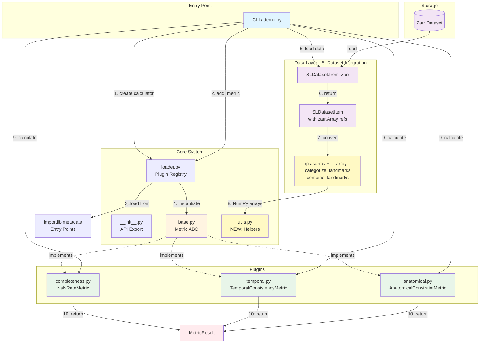
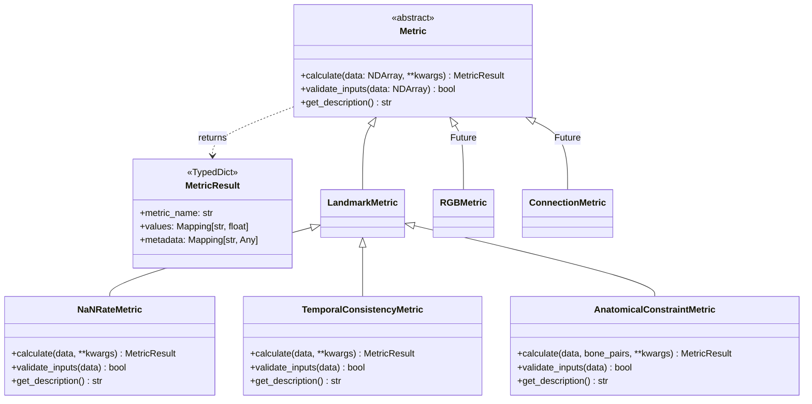
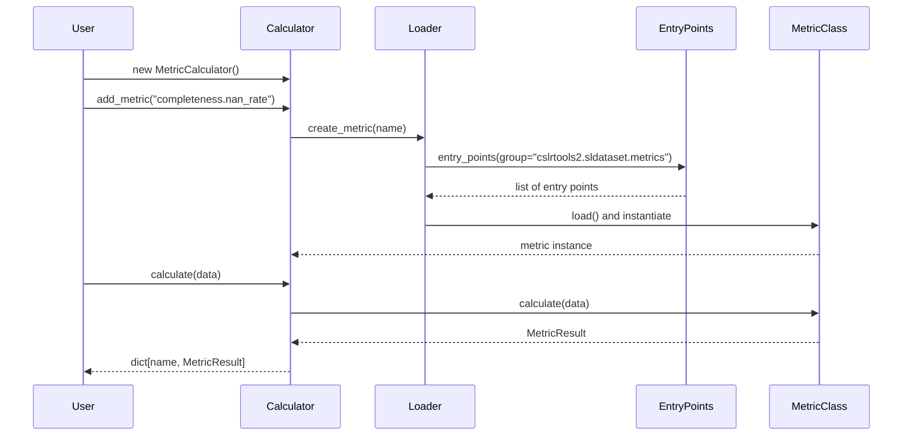
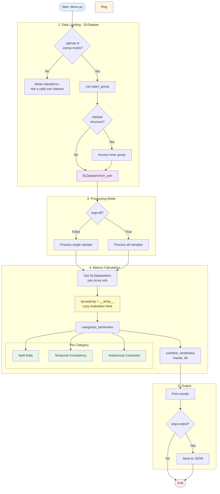
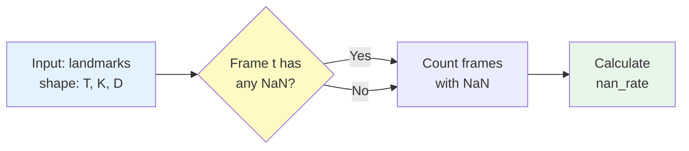
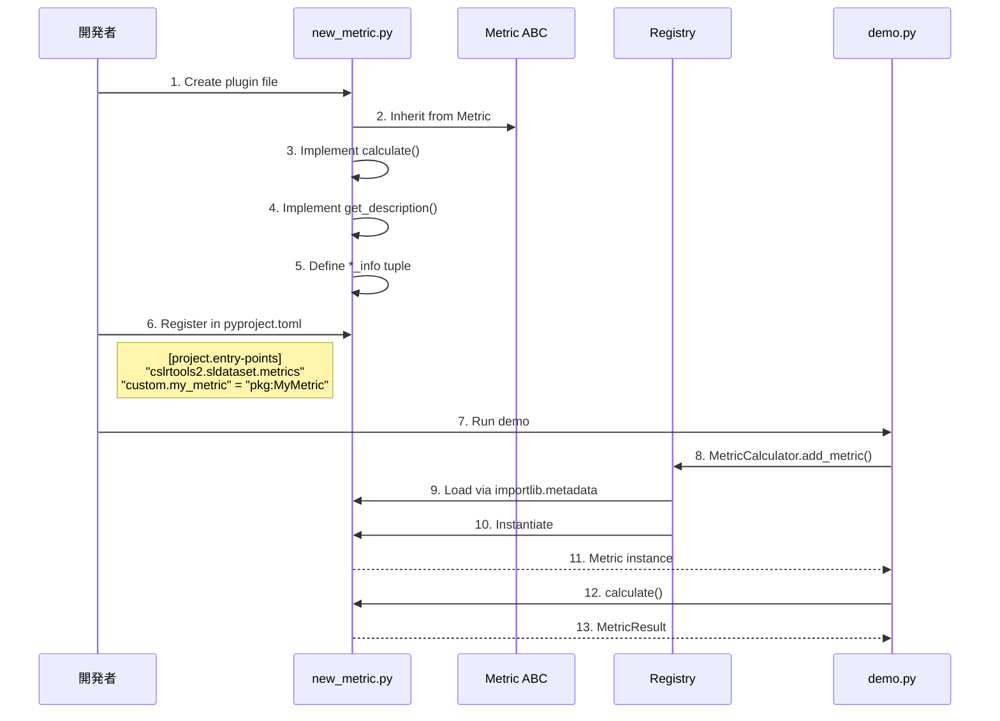
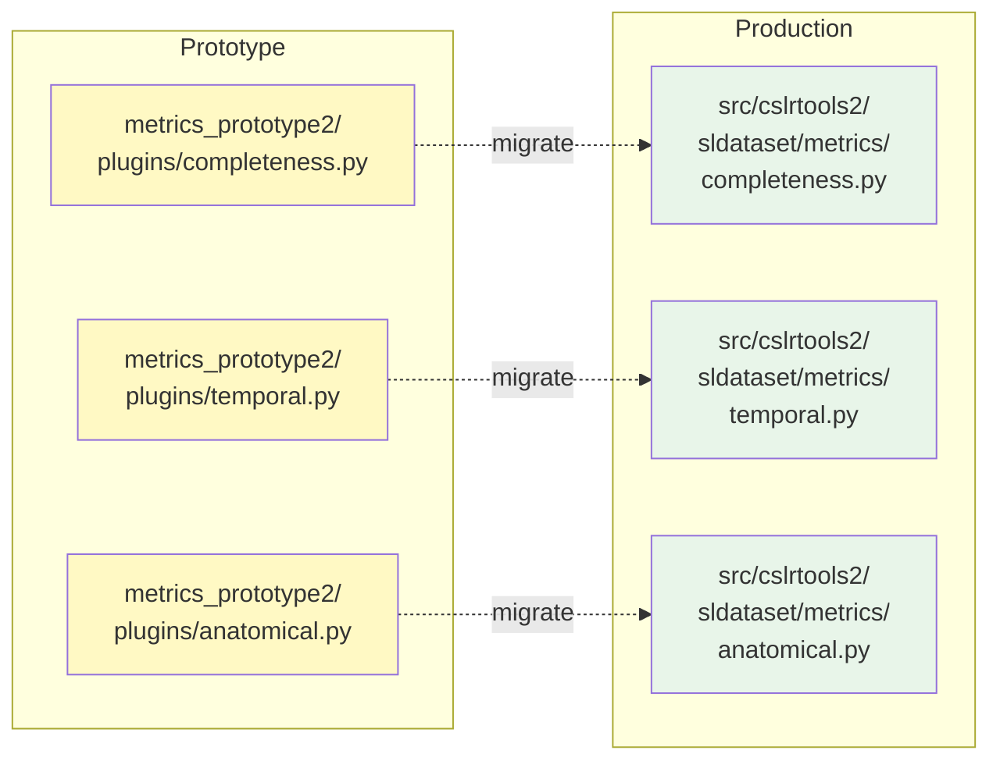

# metrics_prototype2/ アーキテクチャ解説

**作成日**: 2025年12月2日  
**ステータス**: PROTOTYPE v2 - SLDataset統合版  
**前バージョン**: metrics_prototype/ (削除済み)

---

## 📋 概要

`metrics_prototype2/` は、ランドマーク品質評価のためのプラグインベースの
メトリクスシステムのプロトタイプ第2版です。v1からの主要な改善点は、
**cslrtools2.sldataset との完全な統合**です。

### バージョン履歴

**v2.1 (2025-12-02)**: importlib.metadata統合、Calculator パターン追加

| 項目 | v1 | v2.0 | v2.1 (Latest) |
|------|----|----|----|
| プラグイン登録 | シミュレート | シミュレート | importlib.metadata |
| ユーザーAPI | 直接インスタンス化 | create_metric() | MetricCalculator |
| メトリクス階層 | Metric | Metric | Metric → LandmarkMetric |
| zarr判定 | N/A | .zarr拡張子 | .zgroup/.zarray チェック |
| データ読み込み | 手動zarr走査 | `SLDataset.from_zarr()` | 同左 |
| 遅延読み込み | カスタム実装 | zarr.Array参照活用 | 同左 |
| データ変換 | インライン | `to_numpy_landmarks()` | `np.asarray()` + `__array__` |
| ユーティリティ | なし | `utils.py` 新設 | 同左 |
| コード量 | 基準 | 30-40%削減 | 40-50%削減 |
| 型安全性 | 基本 | 強化（DTypeLike等） | 同左 |

---

## 🏗️ ディレクトリ構造

```
metrics_prototype2/
├── __init__.py           # メインエントリポイント、API公開
├── base.py              # 抽象基底クラス (Metric ABC)
├── loader.py            # プラグイン登録・検索システム
├── utils.py             # NEW: ランドマーク処理ユーティリティ
├── demo.py              # デモスクリプト（SLDataset統合版）
├── README.md            # プロトタイプ説明
└── plugins/             # メトリクス実装
    ├── __init__.py
    ├── completeness.py  # Phase 1: NaN率計算
    ├── temporal.py      # Phase 2: 時間的一貫性
    └── anatomical.py    # Phase 3: 骨格制約
```

---

## 🔄 システム全体のフロー



---

## 🔑 v2.1 主要変更点

### 1. importlib.metadata 統合

**変更前 (v2.0)**: シミュレートされたレジストリ
```python
_SIMULATED_PLUGINS = {}
register_metric("completeness.nan_rate", NaNRateMetric, {})
```

**変更後 (v2.1)**: Entry Points経由
```python
# pyproject.toml
[project.entry-points."cslrtools2.sldataset.metrics"]
"completeness.nan_rate" = "package:NaNRateMetric"

# Python code
eps = entry_points(group="cslrtools2.sldataset.metrics")
```

### 2. Calculator パターン

**変更前 (v2.0)**: 直接インスタンス化
```python
metric = create_metric("completeness.nan_rate")
result = metric.calculate(data)
```

**変更後 (v2.1)**: Calculator管理
```python
calculator = MetricCalculator()
calculator.add_metric("completeness.nan_rate")
results = calculator.calculate(data)  # 全メトリクス一括実行
```

### 3. データ変換の簡素化

**変更前 (v2.0)**: 専用関数
```python
from metrics_prototype2.utils import to_numpy_landmarks
landmarks_np = to_numpy_landmarks(item.landmarks)
```

**変更後 (v2.1)**: 標準NumPy関数
```python
import numpy as np
landmarks_np = {k: np.asarray(v) for k, v in item.landmarks.items()}
```

### 4. zarr判定の改善

**変更前 (v2.0)**: 拡張子チェック（不正確）
```python
if str(dataset_path).endswith(".zarr"):
    root = zarr.open_group(dataset_path, mode="r")
```

**変更後 (v2.1)**: メタデータファイル存在チェック
```python
zarr_json_path = dataset_path / ".zgroup"
if not zarr_json_path.exists():
    zarr_json_path = dataset_path / ".zarray"

if zarr_json_path.exists():
    root = zarr.open_group(str(dataset_path), mode="r")
else:
    raise ValueError("Not a valid zarr dataset")
```

---

## 🎯 コアコンポーネント

### 1. base.py - 抽象基底クラス (v2.1: 階層化)

**役割**: すべてのメトリクスが実装すべきインターフェースを定義



**v2.1 クラス階層**:
- `Metric`: 全メトリクスの汎用ベースクラス
- `LandmarkMetric`: ランドマーク品質評価専用（`NDArray[np.float32]`入力）
- (Future) `RGBMetric`, `ConnectionMetric`, `TargetMetric`: 将来の拡張

**主要な設計原則**:
- **エンジン非依存**: MediaPipe, OpenPose等の特定エンジンに依存しない
- **Ground Truth不要**: 参照データなしで評価可能
- **型安全**: PEP 695ジェネリクスとPyright strict準拠

**入力データ形式**:
```python
data: NDArray[np.float32]  # shape: (frames, keypoints, coordinates)
# 例: (300, 33, 3) = 300フレーム、33キーポイント、xyz座標
```

---

### 2. loader.py - プラグインシステム (v2.1: importlib.metadata統合)

**役割**: 外部メトリクスの動的検出とCalculatorパターン提供



**v2.1 Calculator Pattern**:
```python
from metrics_prototype2 import MetricCalculator
import numpy as np

# 1. Create calculator
calculator = MetricCalculator()

# 2. Register metrics
calculator.add_metric("completeness.nan_rate")
calculator.add_metric("temporal.smoothness", window=5)

# 3. Calculate all at once
landmarks_np = {k: np.asarray(v) for k, v in item.landmarks.items()}
results = calculator.calculate(landmarks_np["mediapipe.pose"])

# 4. Access results
print(results["completeness.nan_rate"]["value"])  # 0.05
```

**外部プロジェクトでの登録 (pyproject.toml)**:
```toml
[project.entry-points."cslrtools2.sldataset.metrics"]
"custom.my_metric" = "my_package.metrics:MyMetric"
```

**MetricInfo構造**:
```python
class MetricInfo(TypedDict):
    name: str                      # "completeness.nan_rate"
    category: str                  # "completeness"
    metric_name: str               # "nan_rate"
    metric_class: type[Metric]     # NaNRateMetric
    default_params: Mapping[str, Any]  # {}
```

---

### 3. utils.py - ランドマーク処理ユーティリティ ⭐ NEW

**役割**: メトリクス計算に必要なデータ変換・分類

```mermaid
graph LR
    subgraph "Input: SLDatasetItem"
        I1[landmarks: Mapping<br/>zarr.Array refs]
    end
    
    subgraph "utils.py Functions"
        F1[to_numpy_landmarks]
        F2[categorize_landmarks]
        F3[combine_landmarks]
    end
    
    subgraph "Output"
        O1[NumPy arrays<br/>dict[str, ndarray]]
        O2[Categories<br/>dict[str, list]]
        O3[Combined array<br/>ndarray]
    end
    
    I1 -->|convert| F1
    F1 --> O1
    O1 -->|classify| F2
    F2 --> O2
    O1 -->|merge| F3
    F3 --> O3
    
    style I1 fill:#f3e5f5
    style F1 fill:#fff9c4
    style F2 fill:#fff9c4
    style F3 fill:#fff9c4
    style O1 fill:#e8f5e9
    style O2 fill:#e8f5e9
    style O3 fill:#e8f5e9
```

#### 3.1 np.asarray() + `__array__` プロトコル (v2.1 変更)

**目的**: zarr.Array参照をNumPy配列に変換（遅延読み込みの実行ポイント）

**v2.1 では `to_numpy_landmarks()` を削除し、標準的な `np.asarray()` を推奨**:

```python
import numpy as np
from cslrtools2.sldataset import SLDataset
import zarr

root = zarr.open_group("dataset.zarr", mode="r")
dataset = SLDataset.from_zarr(root)
item = dataset[0]  # zarr.Array references

# v2.1: リスト内包表記 + np.asarray()
landmarks_np = {
    k: np.asarray(v, dtype=np.float32) 
    for k, v in item.landmarks.items()
}
# landmarks_np = {"mediapipe.pose": ndarray(300, 33, 3), ...}
```

**変更理由**:
- `zarr.Array` は `__array__()` プロトコルを実装済み
- 専用関数は不要（NumPy標準機能で十分）
- コード簡潔化

#### 3.2 categorize_landmarks() (v2.1 アルゴリズム改善)

**目的**: ランドマークキーを体の部位ごとに分類

**v2.1 変更点**: `.` 分割の最後のトークンでカテゴリー判定

```python
def categorize_landmarks(landmark_keys: Iterable[str]) -> dict[str, list[str]]:
    """Categorize by suffix after last '.'
    
    Examples:
        "mediapipe.pose" -> "pose" -> Pose category
        "openpose.left_hand" -> "left_hand" -> Left Hand category
    """
    # v2.1: rsplit(".", 1)[-1] で判定
    suffix = key.rsplit(".", 1)[-1].lower()
    if suffix in ("pose", "body"):
        categories["Pose"].append(key)
```

**利点**: エンジン名（mediapipe, openpose等）に非依存

```python
def categorize_landmarks(
    landmark_keys: Iterable[str]
) -> dict[str, list[str]]:
    """Categorize landmark keys by body part.
    
    Recognizes:
        - Pose: Full body keypoints
        - Left Hand: Left hand keypoints
        - Right Hand: Right hand keypoints
        - Face: Facial landmarks
    """
```

**認識パターン**:
- **Pose**: `"pose"`, `"body"` を含む
- **Left Hand**: `"left"` + `"hand"` を含む
- **Right Hand**: `"right"` + `"hand"` を含む
- **Face**: `"face"`, `"facial"` を含む

**使用例**:
```python
keys = ["mediapipe.pose", "mediapipe.left_hand", "mediapipe.right_hand"]
categories = categorize_landmarks(keys)
# {
#   "Pose": ["mediapipe.pose"],
#   "Left Hand": ["mediapipe.left_hand"],
#   "Right Hand": ["mediapipe.right_hand"]
# }
```

#### 3.3 combine_landmarks()

**目的**: 複数のランドマーク配列を結合（例: 両手、全体）

```python
def combine_landmarks(
    landmarks: Mapping[str, np.ndarray],
    keys: list[str],
    axis: int = 1
) -> np.ndarray:
    """Combine multiple landmark arrays along specified axis.
    
    Args:
        landmarks: Mapping of landmark key to NumPy array
        keys: Keys to combine
        axis: Axis to concatenate along (default: 1 for keypoints)
    """
```

**使用例**:
```python
# 両手の結合
hands_keys = ["mediapipe.left_hand", "mediapipe.right_hand"]
hands_combined = combine_landmarks(landmarks_np, hands_keys, axis=1)
# shape: (300, 42, 3)  # 21 + 21 = 42 keypoints

# 全体の結合
all_keys = list(landmarks_np.keys())
all_combined = combine_landmarks(landmarks_np, all_keys, axis=1)
# shape: (300, 543, 3)  # 33 + 21 + 21 + 468 = 543 keypoints
```

**設計判断**: なぜ `sldataset.utils` に入れないのか？

1. **メトリクス固有のロジック**: 体部位の分類は用途依存
2. **拡張性**: 将来的に異なる分類スキームが必要になる可能性
3. **責任分離**: `sldataset` はデータ読み込み、`metrics` は評価処理

---

### 4. demo.py - SLDataset統合デモ

**役割**: v2の主要改善点を実証

#### v1 vs v2 比較

| 機能 | v1実装 | v2実装 |
|------|--------|--------|
| データ読み込み | 手動zarr走査 | `SLDataset.from_zarr()` |
| 遅延評価 | カスタムiterator | zarr.Array参照 |
| データ変換 | インライン処理 | `np.asarray()` + `__array__` |
| zarr判定 | N/A | `.zgroup`/`.zarray` チェック |
| 部位分類 | なし | `categorize_landmarks()` |
| 結合処理 | 手動 | `combine_landmarks()` |

#### フローチャート



#### 使用例

```bash
# 単一サンプル
uv run python -m metrics_prototype2.demo \
    --dataset C:\path\to\dataset.zarr \
    --sample-idx 0

# 全サンプル + JSON出力
uv run python -m metrics_prototype2.demo \
    --dataset C:\path\to\dataset.zarr \
    --all \
    --output results.json
```

---

## 📊 実装されたメトリクス

### Phase 1: Completeness (completeness.py)



**数式**:
```
frame_has_nan[t] = ∨_{k,d} isNaN(X[t, k, d])
nan_rate = (1/T) Σ_t frame_has_nan[t]
```

**解釈**:
- `0.0` (0%): 完全なデータ、欠損なし
- `0.2` (20%): 20%のフレームに欠損あり（推奨閾値）
- `1.0` (100%): 全フレームに欠損あり（無効）

---

### Phase 2: Temporal Consistency (temporal.py)

```mermaid
graph TD
    Input[Input: landmarks<br/>shape: T, K, D]
    
    subgraph "Velocity Calculation"
        V[velocity = X[t+1] - X[t]<br/>shape: T-1, K, D]
    end
    
    subgraph "Acceleration Calculation"
        A[acceleration = V[t+1] - V[t]<br/>shape: T-2, K, D]
    end
    
    subgraph "Statistics"
        S1[mean_velocity = mean|V|]
        S2[smoothness = std A]
    end
    
    Input --> V
    V --> A
    A --> S1
    A --> S2
    
    style Input fill:#e3f2fd
    style V fill:#fff9c4
    style A fill:#ffe0b2
    style S1 fill:#e8f5e9
    style S2 fill:#e8f5e9
```

**数式**:
```
velocity[t] = X[t+1] - X[t]
acceleration[t] = velocity[t+1] - velocity[t]
smoothness = std(acceleration)
```

**解釈**:
- **低いsmoothness**: 滑らかな動き（良好）
- **高いsmoothness**: ジッタが多い（要改善）

**最小フレーム数**: 3フレーム（加速度計算のため）

---

### Phase 3: Anatomical Constraint (anatomical.py)

```mermaid
graph TD
    Input[Input: landmarks + bone_pairs<br/>shape: T, K, D]
    
    subgraph "Per Bone Pair i, j"
        B1[bone_vector = X[:, i] - X[:, j]]
        B2[bone_length = ||bone_vector||<br/>shape: T]
        B3[mean_length = mean bone_length]
        B4[std_length = std bone_length]
        B5[CV = std_length / mean_length]
    end
    
    subgraph "Summary Statistics"
        S1[mean_variation = mean CV]
        S2[std_variation = std CV]
    end
    
    Input --> B1
    B1 --> B2
    B2 --> B3
    B2 --> B4
    B3 --> B5
    B4 --> B5
    B5 --> S1
    B5 --> S2
    
    style Input fill:#e3f2fd
    style B2 fill:#fff9c4
    style B5 fill:#ffe0b2
    style S1 fill:#e8f5e9
    style S2 fill:#e8f5e9
```

**数式**:
```
bone_length[t] = ||X[t, i] - X[t, j]||₂
CV = std(bone_length) / mean(bone_length)
mean_variation = (1/N) Σ_bones CV
```

**MediaPipe Poseボーン定義** (12本):
- **Torso**: 肩、腰の接続
- **Left Arm**: 肩→肘→手首
- **Right Arm**: 肩→肘→手首
- **Left Leg**: 腰→膝→足首
- **Right Leg**: 腰→膝→足首

**解釈**:
- **低いmean_variation**: 一貫した骨格構造（良好）
- **高いmean_variation**: 物理的に不自然な姿勢（要改善）

---

## 🔌 プラグインシステムの拡張

### 新しいメトリクスの追加方法



### テンプレート

```python
# metrics_prototype2/plugins/my_metric.py

from __future__ import annotations
from typing import Any
import numpy as np
from numpy.typing import NDArray
from metrics_prototype2.base import LandmarkMetric, MetricResult

class MyMetric(LandmarkMetric):
    """Brief description of your metric.
    
    v2.1: Inherits from LandmarkMetric for landmark-specific metrics.
    Use base Metric class for other metric types (RGB, Connection, etc.)
    
    Detailed explanation, mathematical formula, interpretation.
    """
    
    def calculate(
        self, data: NDArray[np.float32], **kwargs: Any
    ) -> MetricResult:
        """Calculate the metric.
        
        Args:
            data: Landmark array (T, K, D)
            **kwargs: Additional parameters
        
        Returns:
            MetricResult with values and metadata
        """
        self.validate_inputs(data)
        
        # Your calculation here
        value = np.mean(data)
        
        return MetricResult(
            metric_name="my_metric",
            values={"score": float(value)},
            metadata={"shape": data.shape},
        )
    
    def get_description(self) -> str:
        return "Description of what this metric measures"

# Plugin info
my_metric_info: tuple[type[MyMetric], dict[str, Any]] = (MyMetric, {})
```

---

## 🧪 テスト戦略

### ユニットテスト構造

```
tests/unit/metrics_prototype2/
├── test_base.py              # Metric ABC
├── test_loader.py            # Plugin registry
├── test_utils.py             # Utility functions
├── test_completeness.py      # NaN rate metric
├── test_temporal.py          # Temporal consistency
└── test_anatomical.py        # Anatomical constraint
```

### テストケース例

```python
# tests/unit/metrics_prototype2/test_completeness.py

import numpy as np
import pytest
from metrics_prototype2.plugins.completeness import NaNRateMetric

def test_nan_rate_no_missing():
    """完全なデータ: nan_rate = 0.0"""
    metric = NaNRateMetric()
    data = np.random.rand(100, 33, 3).astype(np.float32)
    result = metric.calculate(data)
    assert result["values"]["nan_rate"] == 0.0

def test_nan_rate_partial_missing():
    """10フレーム欠損: nan_rate = 0.1"""
    metric = NaNRateMetric()
    data = np.random.rand(100, 33, 3).astype(np.float32)
    data[10:20, :, :] = np.nan
    result = metric.calculate(data)
    assert result["values"]["nan_rate"] == 0.1

def test_nan_rate_all_missing():
    """全フレーム欠損: ValueError"""
    metric = NaNRateMetric()
    data = np.full((100, 33, 3), np.nan, dtype=np.float32)
    with pytest.raises(ValueError, match="All frames.*contain NaN"):
        metric.calculate(data)
```

---

## 🚀 本番統合ロードマップ

### Phase 1: コアモジュール移行 ✅ 完了

- [x] `base.py` → `src/cslrtools2/sldataset/metrics/base.py`
- [x] `loader.py` → `src/cslrtools2/sldataset/metrics/loader.py`
- [x] `utils.py` → `src/cslrtools2/sldataset/metrics/utils.py`

### Phase 2: プラグイン移行



### Phase 3: Entry Points設定

```toml
# pyproject.toml
[project.entry-points."cslrtools2.sldataset.metrics"]
"completeness.nan_rate" = "cslrtools2.sldataset.metrics.completeness:nan_rate_info"
"temporal.consistency" = "cslrtools2.sldataset.metrics.temporal:temporal_consistency_info"
"anatomical.bone_length" = "cslrtools2.sldataset.metrics.anatomical:anatomical_constraint_info"
```

### Phase 4: CLI統合

```bash
# 目標コマンド
sldataset calculate-metrics \
    --dataset path/to/dataset.zarr \
    --metrics completeness temporal anatomical \
    --output metrics_report.json
```

```python
# src/cslrtools2/sldataset/app/cli.py

@cli.command()
@click.option("--dataset", type=click.Path(exists=True))
@click.option("--metrics", multiple=True)
@click.option("--output", type=click.Path())
def calculate_metrics(dataset, metrics, output):
    """Calculate quality metrics for landmark data."""
    # Implementation using metrics_prototype2 patterns
    ...
```

### Phase 5: ドキュメント

- [ ] API Reference (Sphinx)
- [ ] チュートリアル
- [ ] 使用例
- [ ] ベストプラクティス

---

## 📚 参考資料

### 設計ドキュメント

- `pose_estimation_metrics_analysis.md` - メトリクス設計の根拠
- `.github/copilot-instructions.md` - 実装ガイドライン
- `guides/CODING_STYLE_GUIDE.md` - コーディング規約

### 学術文献

1. Liu & Yuan, "Recognizing Human Actions as the Evolution of Pose Estimation Maps", CVPR 2018
2. Cao et al., "OpenPose: Realtime Multi-Person 2D Pose Estimation", CVPR 2017
3. Mehta et al., "VNect: Real-time 3D Human Pose Estimation", ACM TOG 2017

---

## 🔍 v2の設計判断まとめ

### ✅ 採用した設計

| 判断 | 理由 |
|------|------|
| `SLDataset.from_zarr()` 使用 | 既存のインフラ活用、コード削減 |
| `utils.py` 分離 | メトリクス固有ロジックの明確化 |
| zarr.Array参照活用 | 遅延読み込みの標準パターン |
| ファイルレベルpyright抑制 | 動的型推論の正当な制限 |

### ❌ 採用しなかった設計

| 判断 | 理由 |
|------|------|
| `IterableSLDataset` 作成 | 既存の遅延読み込みで十分 |
| `as_numpy()` メソッド | 拡張機能で対応すべき |
| `sldataset.utils` へのユーティリティ追加 | 責任分離の原則 |
| カスタム型エイリアス | `DefaultSLDatasetItem` で十分 |

---

## 📝 チェックリスト

### v2.0 プロトタイプ完了基準

- [x] SLDataset統合
- [x] Phase 1メトリクス実装（NaN率）
- [x] Phase 2メトリクス実装（時間的一貫性）
- [x] Phase 3メトリクス実装（骨格制約）
- [x] ユーティリティ関数（utils.py）
- [x] デモスクリプト（CLI）
- [x] スタイルガイド準拠（Black, Flake8, Pyright）
- [x] ドキュメント作成

### v2.1 リファクタリング完了基準

- [x] importlib.metadata統合
- [x] MetricCalculatorパターン実装
- [x] Metric → LandmarkMetric階層化
- [x] `to_numpy_landmarks()` 削除（`np.asarray()` 推奨）
- [x] `categorize_landmarks()` rsplit実装
- [x] zarr判定を `.zgroup`/`.zarray` チェックに変更
- [x] ドキュメント更新（v2.1対応）

### 本番統合準備

- [ ] ユニットテスト作成
- [ ] 統合テスト作成
- [ ] パフォーマンステスト
- [ ] 外部プロジェクトでの動作確認
- [ ] CLI統合（`sldataset2 metrics` コマンド）
- [ ] API ドキュメント（Sphinx）

---

## 🔄 変更履歴

### v2.1 (2025-12-02)

**主要変更**:
- importlib.metadata Entry Points統合
- MetricCalculatorパターン追加
- Metric → LandmarkMetric 2層階層
- `to_numpy_landmarks()` 削除、`np.asarray()` + `__array__` 推奨
- `categorize_landmarks()` を rsplit(".", 1)[-1] 実装に変更
- zarr判定を `.zgroup`/`.zarray` 存在チェックに変更

**破壊的変更**:
- `register_metric()` 関数削除
- `to_numpy_landmarks()` 削除
- プラグインは `LandmarkMetric` を継承

**移行ガイド**:
```python
# v2.0
from metrics_prototype2 import register_metric, create_metric
from metrics_prototype2.utils import to_numpy_landmarks

register_metric("completeness.nan_rate", NaNRateMetric, {})
metric = create_metric("completeness.nan_rate")
landmarks_np = to_numpy_landmarks(item.landmarks)

# v2.1
from metrics_prototype2 import MetricCalculator
import numpy as np

calculator = MetricCalculator()
calculator.add_metric("completeness.nan_rate")
landmarks_np = {k: np.asarray(v) for k, v in item.landmarks.items()}
results = calculator.calculate(landmarks_np["mediapipe.pose"])
```

### v2.0 (2025-11-27)

- 初版リリース
- SLDataset統合
- Phase 1-3メトリクス実装

---

**最終更新**: 2025年12月2日  
**ステータス**: v2.1 リファクタリング完了、本番統合待ち
