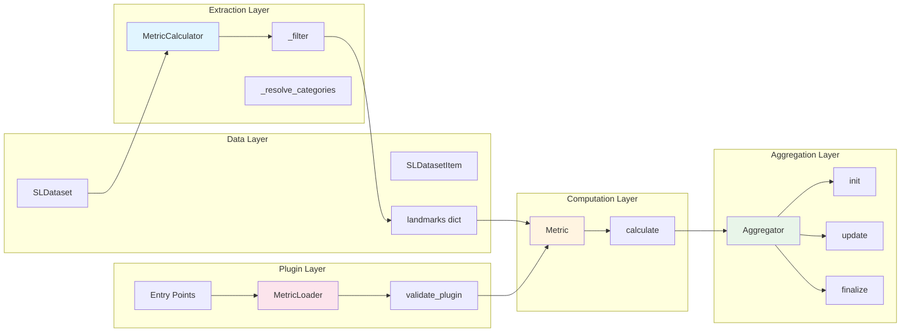
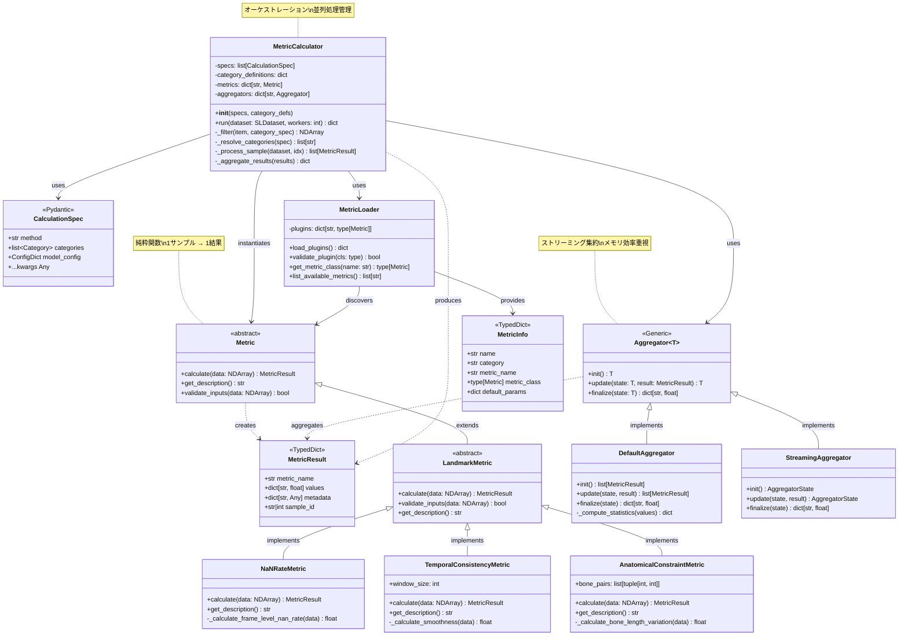
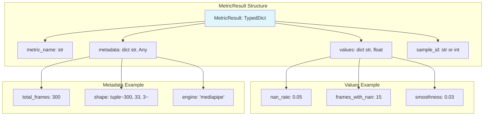
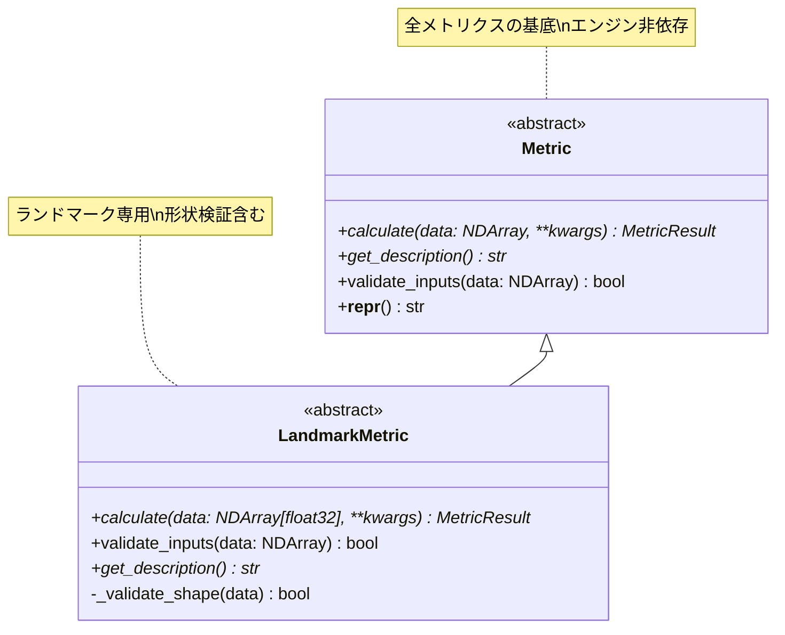
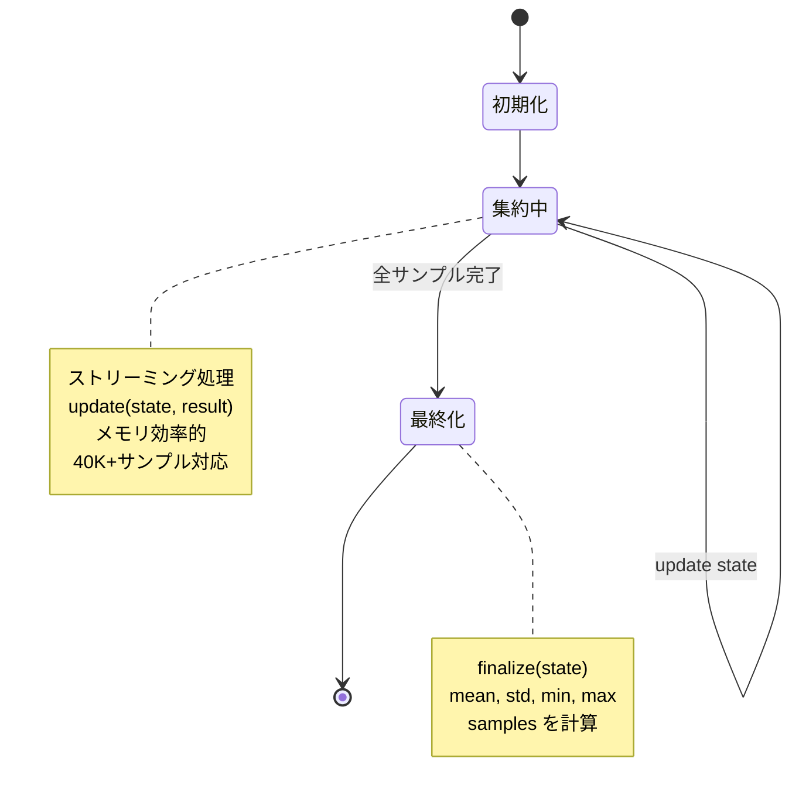
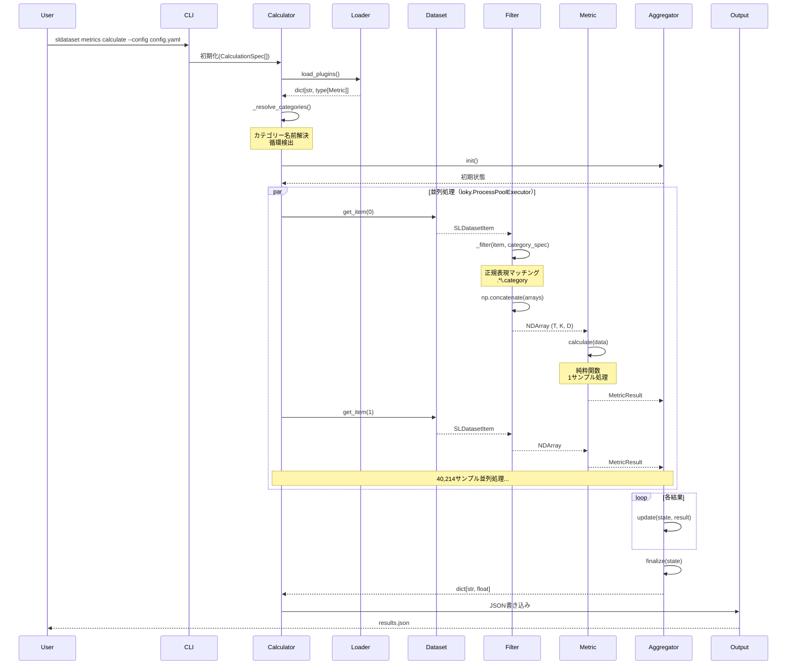
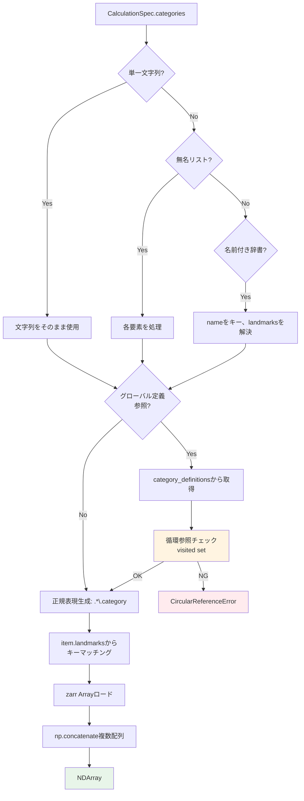
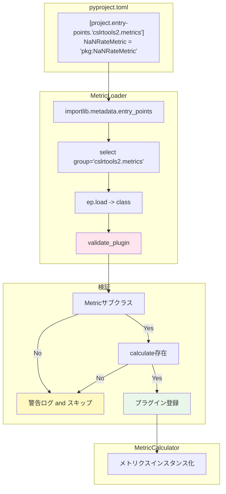
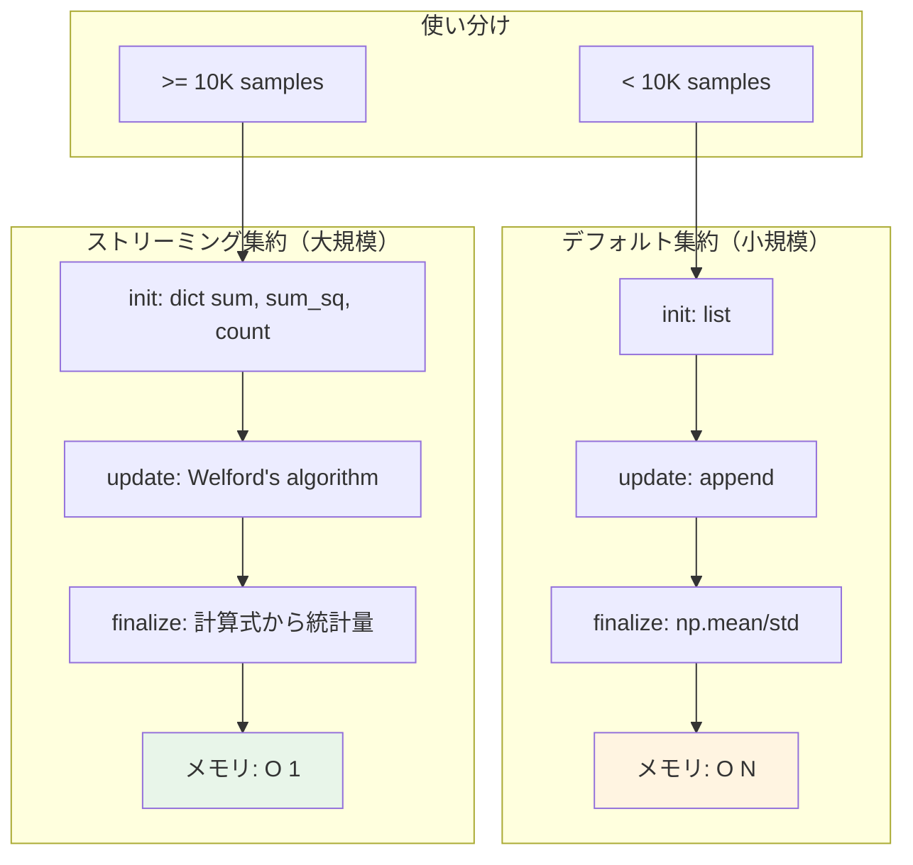
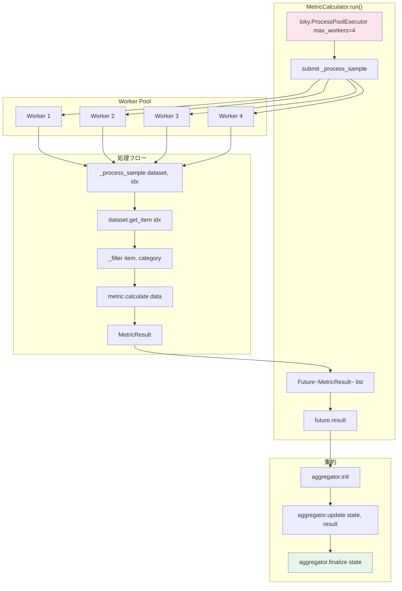

# Metrics System リファクタリング後アーキテクチャ

**作成日**: 2025-12-03  
**基準**: METRICS_IMPLEMENTATION_DRAFT.md + metrics_prototype2/ + evaluate_real_dataset_v2.py  
**ステータス**: 設計確定版（実装ガイド）

---

## 📋 目次

1. [設計原則](#設計原則)
2. [クラス階層全体図](#クラス階層全体図)
3. [コアコンポーネント](#コアコンポーネント)
4. [データフローアーキテクチャ](#データフローアーキテクチャ)
5. [プラグインシステム](#プラグインシステム)
6. [集約システム](#集約システム)
7. [並列処理アーキテクチャ](#並列処理アーキテクチャ)
8. [ファイル構成](#ファイル構成)
9. [実装例](#実装例)

---

## 設計原則

### 1. 責任の明確な分離（Separation of Concerns）



**各層の責務**:

| 層 | 責務 | 担当クラス |
|----|------|-----------|
| Data | データ保持・アクセス | `SLDataset`, `SLDatasetItem` |
| Extraction | データ抽出・カテゴリー解決 | `MetricCalculator._filter()`, `_resolve_categories()` |
| Computation | メトリクス計算（純粋関数） | `Metric.calculate()` |
| Aggregation | 結果集約・統計計算 | `Aggregator.init/update/finalize()` |
| Plugin | プラグイン発見・検証 | `MetricLoader`, Entry Points |

---

## クラス階層全体図



---

## コアコンポーネント

### 1. MetricResult（型定義）

**決定事項**: TypedDict（Q23）



**実装**:

```python
from typing import TypedDict, Any

class MetricResult(TypedDict):
    """メトリクス計算結果（TypedDict版）
    
    選択理由:
    - 最軽量（40K+サンプルの集約で有利）
    - 静的型チェック（Pyright）で型安全性確保
    - 辞書互換性（JSON変換容易）
    """
    metric_name: str
    values: dict[str, float]
    metadata: dict[str, Any]
    sample_id: str | int
```

---

### 2. Metric基底クラス

**決定事項**: ストリーミングAPIは含めない（Q27）



**実装**:

```python
from abc import ABC, abstractmethod
from typing import Any
import numpy as np
from numpy.typing import NDArray

class Metric(ABC):
    """全メトリクスの抽象基底クラス
    
    設計原則:
    - 純粋関数: 1サンプル → 1結果
    - エンジン非依存: NumPy配列で動作
    - Ground Truth不要
    """
    
    @abstractmethod
    def calculate(self, data: Any, **kwargs: Any) -> MetricResult:
        """メトリクス計算
        
        Args:
            data: 入力データ（型はサブクラスで定義）
            **kwargs: メトリクス固有のパラメータ
        
        Returns:
            計算結果（MetricResult）
        """
        pass
    
    @abstractmethod
    def get_description(self) -> str:
        """メトリクスの説明を返す"""
        pass
    
    def validate_inputs(self, data: Any) -> bool:
        """入力データの検証（オプション）"""
        return True
    
    def __repr__(self) -> str:
        return f"{self.__class__.__name__}()"


class LandmarkMetric(Metric):
    """ランドマーク品質メトリクスの基底クラス
    
    期待する入力形状: (frames, keypoints, coordinates)
    - frames: フレーム数（T）
    - keypoints: キーポイント数（K）、例: MediaPipe Poseで33
    - coordinates: 座標次元（D）、通常3（x, y, z）または4（x, y, z, visibility）
    """
    
    @abstractmethod
    def calculate(self, data: NDArray[np.float32], **kwargs: Any) -> MetricResult:
        """ランドマークデータからメトリクス計算
        
        Args:
            data: shape (T, K, D) のランドマーク配列
            **kwargs: パラメータ
        
        Returns:
            計算結果
        """
        pass
    
    def validate_inputs(self, data: NDArray[np.float32]) -> bool:
        """3次元配列かつフレーム数 >= 1 を検証"""
        if data.ndim != 3:
            return False
        
        frames, keypoints, coords = data.shape
        return frames >= 1 and keypoints >= 1 and coords >= 1
    
    @abstractmethod
    def get_description(self) -> str:
        pass
```

---

### 3. Aggregator（集約システム）

**決定事項**: Metricとは分離（Q27）



**実装**:

```python
from typing import Generic, TypeVar

T = TypeVar('T')  # 集約状態の型

class Aggregator(Generic[T]):
    """メトリクス結果の集約基底クラス
    
    ストリーミング集約をサポート:
    - init(): 初期状態を生成
    - update(): 1サンプル結果で状態更新
    - finalize(): 最終集約結果を計算
    """
    
    def init(self) -> T:
        """初期集約状態を返す
        
        Returns:
            初期状態（型は実装による）
        """
        raise NotImplementedError
    
    def update(self, state: T, result: MetricResult) -> T:
        """1サンプルの結果で状態を更新
        
        Args:
            state: 現在の集約状態
            result: 新しいメトリクス結果
        
        Returns:
            更新後の状態
        """
        raise NotImplementedError
    
    def finalize(self, state: T) -> dict[str, float]:
        """最終集約結果を計算
        
        Args:
            state: 最終状態
        
        Returns:
            集約統計量（mean, std, min, max, samples等）
        """
        raise NotImplementedError


class DefaultAggregator(Aggregator[list[MetricResult]]):
    """デフォルト集約実装（リスト蓄積型）
    
    全結果をメモリに保持し、最後に統計量を計算。
    小〜中規模データセット向け。
    """
    
    def init(self) -> list[MetricResult]:
        return []
    
    def update(self, state: list[MetricResult], result: MetricResult) -> list[MetricResult]:
        state.append(result)
        return state
    
    def finalize(self, state: list[MetricResult]) -> dict[str, float]:
        """mean, std, min, max, samples を計算"""
        if not state:
            return {}
        
        # 全結果から値を抽出（例: 'nan_rate' キー）
        # 実際にはメトリクス名に応じて動的に処理
        values = [r['values'] for r in state]
        
        # NumPyで統計計算
        import numpy as np
        values_array = np.array([list(v.values())[0] for v in values])
        
        return {
            'mean': float(np.mean(values_array)),
            'std': float(np.std(values_array)),
            'min': float(np.min(values_array)),
            'max': float(np.max(values_array)),
            'samples': len(state)
        }


class StreamingAggregator(Aggregator[dict[str, float]]):
    """ストリーミング集約実装（メモリ効率型）
    
    Welfordアルゴリズム等で逐次統計量を更新。
    大規模データセット（40K+サンプル）向け。
    """
    
    def init(self) -> dict[str, float]:
        return {
            'sum': 0.0,
            'sum_sq': 0.0,
            'min': float('inf'),
            'max': float('-inf'),
            'count': 0
        }
    
    def update(self, state: dict[str, float], result: MetricResult) -> dict[str, float]:
        """Welfordアルゴリズムで平均・分散を更新"""
        # 結果から値を抽出（簡略化）
        value = list(result['values'].values())[0]
        
        return {
            'sum': state['sum'] + value,
            'sum_sq': state['sum_sq'] + value ** 2,
            'min': min(state['min'], value),
            'max': max(state['max'], value),
            'count': state['count'] + 1
        }
    
    def finalize(self, state: dict[str, float]) -> dict[str, float]:
        """最終統計量を計算"""
        if state['count'] == 0:
            return {}
        
        mean = state['sum'] / state['count']
        variance = (state['sum_sq'] / state['count']) - mean ** 2
        
        return {
            'mean': mean,
            'std': variance ** 0.5,
            'min': state['min'],
            'max': state['max'],
            'samples': int(state['count'])
        }
```

---

## データフローアーキテクチャ

### 全体フロー



---

### カテゴリー解決フロー



---

## プラグインシステム

### Entry Points発見メカニズム



**決定事項**（Q26）:
- 検証レベル: レベル1（サブクラスチェックのみ）
- タイミング: ロード時
- エラー処理: 警告ログ、スキップして続行
- 実装場所: `loader.py`

**実装**:

```python
# loader.py
import logging
from importlib.metadata import entry_points
from typing import TYPE_CHECKING

if TYPE_CHECKING:
    from .base import Metric

logger = logging.getLogger(__name__)

def load_metric_plugins() -> dict[str, type['Metric']]:
    """Entry Pointsからメトリクスプラグインをロード
    
    Returns:
        メトリクス名 → Metricクラスの辞書
    """
    from .base import Metric  # 循環import回避
    
    metrics: dict[str, type[Metric]] = {}
    
    eps = entry_points(group='cslrtools2.metrics')
    
    for ep in eps:
        try:
            plugin_class = ep.load()
            
            # レベル1検証: サブクラスチェック
            if not issubclass(plugin_class, Metric):
                logger.warning(
                    f"Plugin '{ep.name}' is not a Metric subclass, skipping"
                )
                continue
            
            metrics[ep.name] = plugin_class
            logger.info(f"Loaded metric plugin: {ep.name}")
            
        except Exception as e:
            logger.warning(f"Failed to load plugin '{ep.name}': {e}")
    
    return metrics


def list_available_metrics() -> list[str]:
    """利用可能なメトリクス名一覧"""
    return sorted(load_metric_plugins().keys())
```

---

## 集約システム

### デフォルト集約 vs ストリーミング集約



**選択基準**:

| データセット規模 | 推奨Aggregator | 理由 |
|-----------------|---------------|------|
| < 10K サンプル | DefaultAggregator | シンプル、デバッグ容易 |
| >= 10K サンプル | StreamingAggregator | メモリ効率、40K+対応 |

---

## 並列処理アーキテクチャ

### loky.ProcessPoolExecutor統合

**決定事項**（Q24）: loky.ProcessPoolExecutor（lmpipeと統一）



**実装**:

```python
from loky import ProcessPoolExecutor
from concurrent.futures import as_completed

class MetricCalculator:
    def run(self, dataset: SLDataset, workers: int = 4) -> dict:
        """メトリクス計算を並列実行
        
        Args:
            dataset: SLDataset
            workers: ワーカー数（デフォルト: 4）
        
        Returns:
            集約結果の辞書
        """
        # Aggregator初期化
        state = self.aggregator.init()
        
        # 並列処理
        with ProcessPoolExecutor(max_workers=workers) as executor:
            futures = [
                executor.submit(self._process_sample, dataset, idx)
                for idx in range(len(dataset))
            ]
            
            # 進捗表示付きで結果収集
            for future in as_completed(futures):
                try:
                    result = future.result()
                    state = self.aggregator.update(state, result)
                except Exception as e:
                    logger.warning(f"Sample processing failed: {e}")
                    # スキップして続行
        
        # 最終集約
        return self.aggregator.finalize(state)
```

---

## ファイル構成

```
src/cslrtools2/sldataset/metrics/
├── __init__.py ..................... MetricCalculator, MetricLoader export
├── base.py ......................... Metric, LandmarkMetric, MetricResult
├── aggregators.py .................. Aggregator, DefaultAggregator, StreamingAggregator
├── calculator.py ................... MetricCalculator（オーケストレーター）
├── loader.py ....................... MetricLoader（プラグイン発見）
├── utils.py ........................ ヘルパー関数
│
└── methods/ ........................ メトリクス実装（カテゴリー別）
    ├── __init__.py ................. 各カテゴリーのexport
    │
    ├── completeness/ ............... Phase 1: 完全性メトリクス
    │   ├── __init__.py
    │   └── nan_rate.py ............. NaNRateMetric
    │
    ├── temporal/ ................... Phase 2: 時間的一貫性
    │   ├── __init__.py
    │   ├── consistency.py .......... TemporalConsistencyMetric
    │   └── smoothness.py ........... SmoothnessMetric
    │
    └── anatomical/ ................. Phase 3: 骨格制約
        ├── __init__.py
        ├── constraints.py .......... AnatomicalConstraintMetric
        └── bone_length.py .......... BoneLengthVariationMetric
```

**Entry Points登録** (`pyproject.toml`):

```toml
[project.entry-points."cslrtools2.metrics"]
"completeness.nan_rate" = "cslrtools2.sldataset.metrics.methods.completeness:NaNRateMetric"
"temporal.consistency" = "cslrtools2.sldataset.metrics.methods.temporal:TemporalConsistencyMetric"
"anatomical.constraints" = "cslrtools2.sldataset.metrics.methods.anatomical:AnatomicalConstraintMetric"
```

---

## 実装例

### 1. NaNRateMetric（Phase 1）

```python
# methods/completeness/nan_rate.py
from __future__ import annotations

import numpy as np
from numpy.typing import NDArray

from ...base import LandmarkMetric, MetricResult


class NaNRateMetric(LandmarkMetric):
    """NaN率メトリクス（完全性評価）
    
    フレームレベルのNaN存在率を計算:
        nan_rate = mean(any(isnan(frame)))
    
    推奨閾値: < 0.2 (20%)
    エンジン非依存: ✅
    Ground Truth不要: ✅
    実装推奨度: ⭐⭐⭐⭐⭐
    """
    
    def calculate(self, data: NDArray[np.float32], **kwargs) -> MetricResult:
        """NaN率を計算
        
        Args:
            data: shape (T, K, D) のランドマーク配列
        
        Returns:
            nan_rate を含む MetricResult
        """
        if not self.validate_inputs(data):
            raise ValueError(f"Invalid input shape: {data.shape}")
        
        # フレームごとにNaN存在をチェック
        frames_with_nan = np.any(np.isnan(data), axis=(1, 2))  # shape: (T,)
        nan_rate = np.mean(frames_with_nan)
        
        return MetricResult(
            metric_name='completeness.nan_rate',
            values={
                'nan_rate': float(nan_rate),
                'frames_with_nan': int(np.sum(frames_with_nan))
            },
            metadata={
                'total_frames': data.shape[0],
                'shape': data.shape,
                'threshold_recommended': 0.2
            },
            sample_id=kwargs.get('sample_id', -1)
        )
    
    def get_description(self) -> str:
        return (
            "Calculates the proportion of frames containing at least one NaN value. "
            "Lower is better (0.0 = perfect completeness)."
        )
```

### 2. TemporalConsistencyMetric（Phase 2）

```python
# methods/temporal/consistency.py
from __future__ import annotations

import numpy as np
from numpy.typing import NDArray

from ...base import LandmarkMetric, MetricResult


class TemporalConsistencyMetric(LandmarkMetric):
    """時間的一貫性メトリクス（滑らかさ評価）
    
    加速度の標準偏差で動きの滑らかさを評価:
        velocity = landmarks[1:] - landmarks[:-1]
        acceleration = velocity[1:] - velocity[:-1]
        smoothness = std(acceleration)
    
    低いほど滑らか: ジッタが少ない
    エンジン非依存: ✅
    実装推奨度: ⭐⭐⭐⭐⭐
    """
    
    def __init__(self, window_size: int = 5):
        """
        Args:
            window_size: 平滑化ウィンドウサイズ（未使用、将来拡張用）
        """
        self.window_size = window_size
    
    def calculate(self, data: NDArray[np.float32], **kwargs) -> MetricResult:
        """時間的一貫性を計算
        
        Args:
            data: shape (T, K, D)
        
        Returns:
            smoothness を含む MetricResult
        """
        if not self.validate_inputs(data):
            raise ValueError(f"Invalid input shape: {data.shape}")
        
        if data.shape[0] < 3:
            raise ValueError("Need at least 3 frames for acceleration calculation")
        
        # NaNを含むフレームをマスク
        valid_mask = ~np.any(np.isnan(data), axis=(1, 2))
        
        # 速度計算
        velocity = np.diff(data, axis=0)  # shape: (T-1, K, D)
        
        # 加速度計算
        acceleration = np.diff(velocity, axis=0)  # shape: (T-2, K, D)
        
        # 滑らかさ: 加速度の標準偏差
        smoothness = float(np.nanstd(acceleration))
        
        return MetricResult(
            metric_name='temporal.consistency',
            values={
                'smoothness': smoothness,
                'mean_acceleration': float(np.nanmean(np.abs(acceleration)))
            },
            metadata={
                'total_frames': data.shape[0],
                'valid_frames': int(np.sum(valid_mask)),
                'window_size': self.window_size
            },
            sample_id=kwargs.get('sample_id', -1)
        )
    
    def get_description(self) -> str:
        return (
            "Evaluates temporal consistency by calculating acceleration standard deviation. "
            "Lower values indicate smoother motion (less jitter)."
        )
```

### 3. MetricCalculator使用例

```python
# 使用例
from cslrtools2.sldataset import SLDataset
from cslrtools2.sldataset.metrics import MetricCalculator
from cslrtools2.sldataset.metrics.aggregators import StreamingAggregator

# データセットロード
dataset = SLDataset.from_zarr("path/to/dataset.zarr")

# 設定（YAML相当）
from cslrtools2.sldataset.metrics.calculator import CalculationSpec

specs = [
    CalculationSpec(
        method="completeness.nan_rate",
        categories=["pose"]
    ),
    CalculationSpec(
        method="temporal.consistency",
        categories=[
            {"name": "hands", "landmarks": ["left_hand", "right_hand"]}
        ],
        window_size=5
    )
]

# Calculator初期化
calculator = MetricCalculator(
    specs=specs,
    aggregator=StreamingAggregator()
)

# 実行（並列処理）
results = calculator.run(dataset, workers=4)

print(results)
# {
#   'pose': {
#     'completeness.nan_rate': {
#       'mean': 0.05,
#       'std': 0.02,
#       'min': 0.0,
#       'max': 0.15,
#       'samples': 40214
#     }
#   },
#   'hands': {
#     'temporal.consistency': {
#       'mean': 0.03,
#       ...
#     }
#   }
# }
```

---

## まとめ

### 設計の特徴

| 特徴 | 説明 | 実現方法 |
|------|------|----------|
| **責任分離** | データ・計算・集約を分離 | Metric, Aggregator, Calculatorの3層 |
| **型安全** | 静的型チェック完備 | TypedDict, PEP 695 generics |
| **エンジン非依存** | MediaPipe/OpenPose等に依存しない | NumPy配列ベース |
| **プラグイン可能** | 外部メトリクス追加容易 | Entry Points |
| **メモリ効率** | 40K+サンプル対応 | StreamingAggregator |
| **並列処理** | CPU並列化 | loky.ProcessPoolExecutor |
| **エラー耐性** | 一部失敗でも続行 | try/except + warning log |

### 実装優先度

1. **Phase 1（MVP）**: Metric, Aggregator, Calculator骨格 + NaNRateMetric
2. **Phase 2（並列化）**: loky統合, プログレス表示, エラー処理
3. **Phase 3（高度化）**: ストリーミング集約, チェックポイント, Entry Points
4. **Phase 4（最適化）**: ベンチマーク, ドキュメント, 追加メトリクス

---

**関連ドキュメント**:
- 実装草案: `METRICS_IMPLEMENTATION_DRAFT.md`
- ビジュアル設計: `METRICS_CALCULATOR_DESIGN.md`
- 完全版Q&A: `metrics_calc_memo.md`
- プロトタイプ: `metrics_prototype2/`
