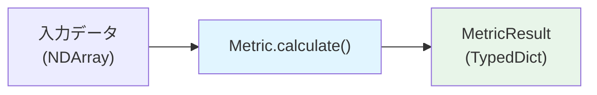
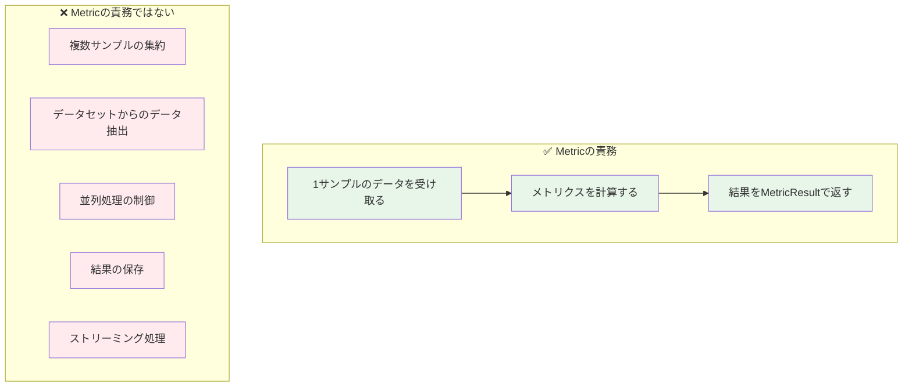
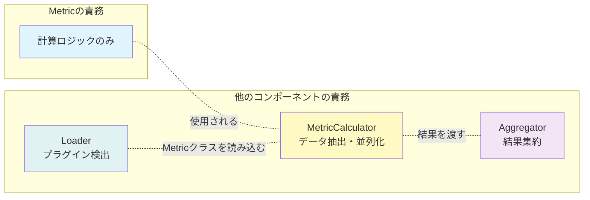
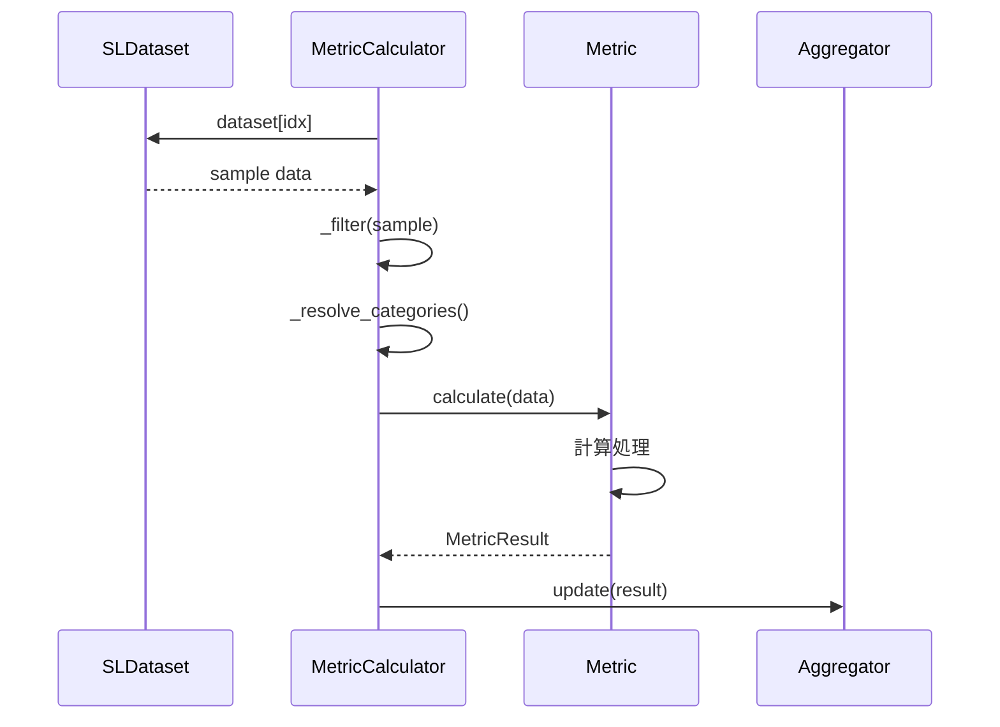
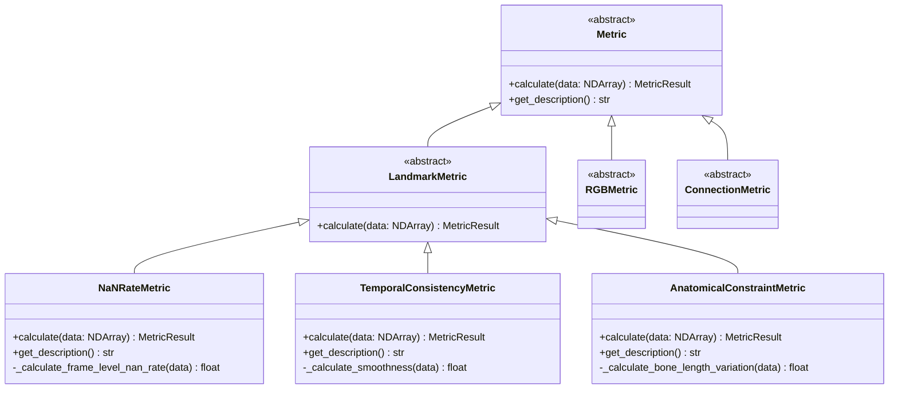
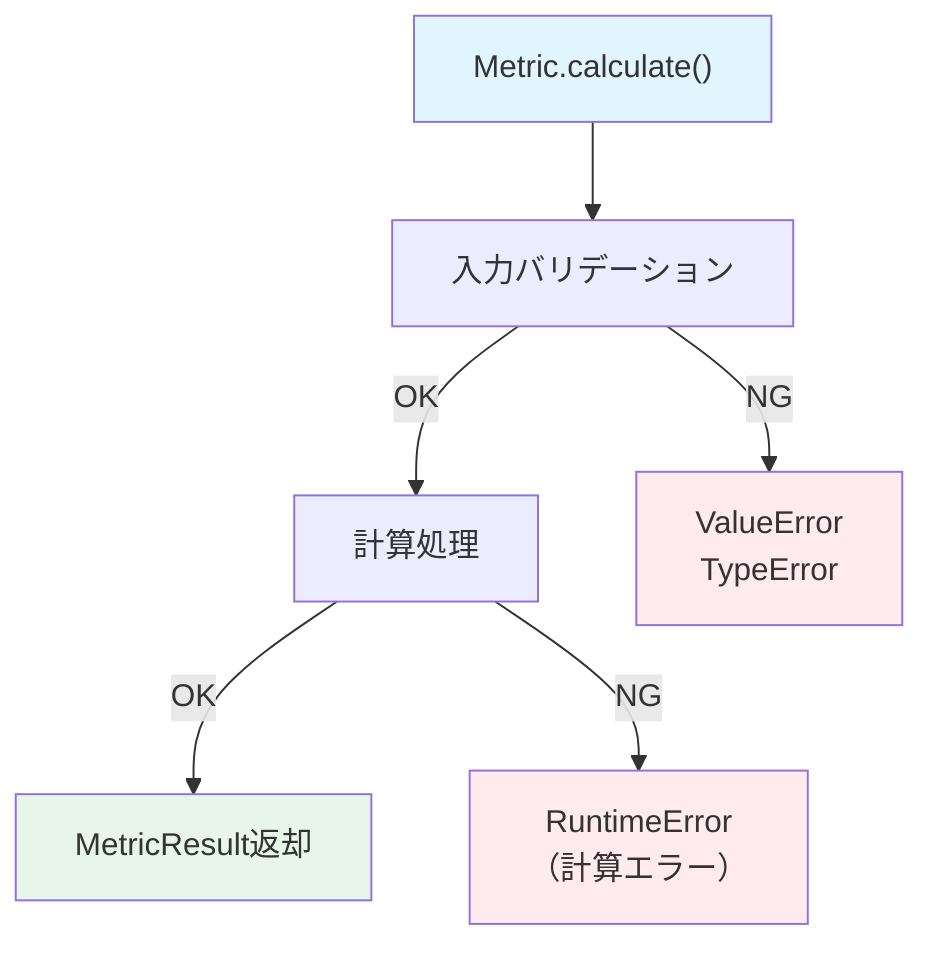

# Metricクラス アーキテクチャ設計

**作成日**: 2025-12-03  
**最終更新**: 2025-12-03（実装からのフィードバック反映）  
**対象**: `cslrtools2.sldataset.metrics.Metric` 基底クラス  
**関連ドキュメント**: 
- 設計メモ: `METRICS_IMPLEMENTATION_DRAFT.md`
- プロトタイプ: `metrics_prototype2/base.py`
- 実装レビュー: `IMPLEMENTATION_REVIEW.md`
- 設計判断Q&A: `SPEC_IMPL_QUESTIONS.md`

---

## 目次

1. [概要](#概要)
2. [設計原則](#設計原則)
3. [クラス定義](#クラス定義)
4. [データフロー](#データフロー)
5. [継承階層](#継承階層)
6. [実装パターン](#実装パターン)
7. [型システム](#型システム)
8. [エラーハンドリング](#エラーハンドリング)

---

## 概要

### Metricクラスとは

`Metric`クラスは、**単一サンプルのデータから1つのメトリクス値を計算する純粋関数**を表現する抽象基底クラス（ABC）です。



### 責務の明確化



**重要**: Metricは**状態を持たない**（ステートレス）。`calculate()`メソッドは副作用を持たない純粋関数として実装します。

---

## 設計原則

### 0. 実装での設計変更（2025-12-03更新）

**重要**: 実装では以下の設計変更が行われています（`SPEC_IMPL_QUESTIONS.md` 参照）:

#### `category_group` 引数の追加

```python
# 実装版シグネチャ
def calculate(
    self,
    category_group: CategoryGroup,  # ← 追加
    data: NDArray[Any]
) -> Mapping[str, Any]:
    ...
```

**理由**: 将来的にカテゴリ別の処理分岐を可能にするため。CategoryGroupが異なるメトリクスインスタンスが作成され、Metric内でカテゴリ固有の処理を実装可能にする。

#### `NDArray[Any]` 型への厳密化

**理由**: 
- 共通テンソル型として `SupportsArray` を使用
- Metricサブクラスでの `np.asarray()` 呼び出しを省略
- `torch.Tensor` も結局C/C++でnumpyと同じメモリ構造を持つため互換性あり

### 1. エンジン非依存（Engine Agnostic）

```python
# ✅ Good: エンジン非依存
def calculate(self, category_group: CategoryGroup, data: NDArray) -> Mapping[str, Any]:
    """任意のランドマーク配列のNaN率を計算"""
    nan_count = np.isnan(data).sum()
    return {"nan_rate": float(nan_count / data.size)}

# ❌ Bad: MediaPipe依存
def calculate(self, results: MediaPipeResults, **kwargs) -> Mapping[str, Any]:
    """MediaPipe特有のデータ構造に依存"""
    landmarks = results.pose_landmarks.landmark
    return {"score": landmarks[0].visibility}
```

### 2. Ground Truth不要（Ground Truth Free）

```python
# ✅ Good: Ground Truthなしで計算可能
def calculate(self, category_group: CategoryGroup, data: NDArray) -> Mapping[str, Any]:
    """データの時間的一貫性を評価"""
    velocity = data[1:] - data[:-1]
    smoothness = np.std(velocity)
    return MetricResult(...)

# ❌ Bad: Ground Truth必須
def calculate(self, data: NDArray, ground_truth: NDArray, **kwargs) -> MetricResult:
    """Ground Truthとの誤差を計算"""
    error = np.linalg.norm(data - ground_truth)
    return MetricResult(...)
```

### 3. 単一責任原則（Single Responsibility）



### 4. 型安全性（Type Safety）

- PEP 695スタイルのジェネリクス使用
- `numpy.typing.NDArray`で配列型を明示
- Pyrightで静的型チェック

---

## クラス定義

### 抽象基底クラス（ABC）

```python
from abc import ABC, abstractmethod
from typing import Any
from numpy.typing import NDArray

class Metric(ABC):
    """メトリクス計算の基底クラス
    
    すべてのメトリクスはこのクラスを継承し、
    `calculate()`メソッドを実装する必要があります。
    
    設計原則:
        - エンジン非依存: 任意のランドマーク推定エンジンで動作
        - Ground Truth不要: 参照データなしで計算可能
        - ステートレス: インスタンス変数を使用しない
        - 純粋関数: 副作用なし
    """
    
    @abstractmethod
    def calculate(self, data: NDArray, **kwargs: Any) -> MetricResult:
        """メトリクスを計算する（純粋関数）
        
        Args:
            data: 入力データ（形状はメトリクスにより異なる）
            **kwargs: メトリクス固有のパラメータ
            
        Returns:
            計算結果を含むMetricResult辞書
            
        Raises:
            ValueError: 入力データの形状が不正
            TypeError: 入力データの型が不正
        """
        pass
    
    @abstractmethod
    def get_description(self) -> str:
        """メトリクスの説明を返す
        
        Returns:
            人間が読める形式のメトリクス説明
        """
        pass
    
    def __repr__(self) -> str:
        """文字列表現"""
        return f"{self.__class__.__name__}()"
```

### MetricResult型

```python
from typing import TypedDict, Any

class MetricResult(TypedDict):
    """メトリクス計算結果の型定義
    
    設計決定（Q23）: TypedDict採用
    理由: 実行時速度優先（40K+サンプルで最軽量）
    
    Attributes:
        metric_name: メトリクス名（例: "NaNRateMetric"）
        values: 計算値の辞書（例: {"nan_rate": 0.05}）
        metadata: 追加情報（形状、パラメータなど）
    """
    metric_name: str
    values: dict[str, float]
    metadata: dict[str, Any]
```

**設計決定の背景**:

| 選択肢 | メリット | デメリット | 決定 |
|--------|----------|-----------|------|
| TypedDict | 最軽量、辞書リテラルで生成可能 | 実行時バリデーションなし | ✅ 採用 |
| dataclass | 明示的、`__post_init__`可能 | オーバーヘッド中 | ❌ |
| Pydantic | 実行時バリデーション | オーバーヘッド大 | ❌ |

---

## データフロー

### 単一サンプルの処理



### 入力データの形状

```python
# LandmarkMetricの場合
data: NDArray  # shape: (frames, keypoints, coordinates)
# 例: (300, 33, 3) = 300フレーム、33キーポイント、xyz座標

# RGBMetricの場合（将来実装）
data: NDArray  # shape: (frames, height, width, channels)
# 例: (300, 480, 640, 3) = 300フレーム、480x640解像度、RGB

# ConnectionMetricの場合（将来実装）
data: NDArray  # shape: (frames, edges, 2)
# 例: (300, 10, 2) = 300フレーム、10エッジ、始点・終点
```

---

## 継承階層

### クラス図



### 実装フェーズ

| クラス | Phase | 優先度 | 推奨度 |
|--------|-------|--------|--------|
| `Metric` | Phase 1 | 最高 | - |
| `LandmarkMetric` | Phase 1 | 最高 | - |
| `NaNRateMetric` | Phase 1 | 最高 | ⭐⭐⭐⭐⭐ |
| `TemporalConsistencyMetric` | Phase 2 | 高 | ⭐⭐⭐⭐⭐ |
| `AnatomicalConstraintMetric` | Phase 3 | 中 | ⭐⭐⭐⭐ |
| `RGBMetric` | Phase 4 | 低 | - |
| `ConnectionMetric` | Phase 4 | 低 | - |

---

## 実装パターン

### Phase 1: 基本指標（NaN率）

```python
from metrics_prototype2.base import LandmarkMetric, MetricResult
import numpy as np
from numpy.typing import NDArray

class NaNRateMetric(LandmarkMetric):
    """フレームレベルのNaN率を計算するメトリクス
    
    計算方法:
        1. 各フレームについて、少なくとも1つのNaNが含まれるか判定
        2. NaNを含むフレームの割合を計算
        
    解釈:
        - 0.0: 完全なデータ（NaNなし）
        - 0.1: 10%のフレームにNaNあり
        - 1.0: 全フレームにNaNあり（無効データ）
    
    推奨閾値: < 0.2 (20%)
    """
    
    def calculate(self, data: NDArray, **kwargs) -> MetricResult:
        """NaN率を計算
        
        Args:
            data: ランドマークデータ shape: (frames, keypoints, coords)
            
        Returns:
            MetricResult with keys:
                - metric_name: "NaNRateMetric"
                - values: {"nan_rate": float}
                - metadata: {"total_frames": int, "frames_with_nan": int}
        """
        if data.ndim != 3:
            raise ValueError(f"Expected 3D array, got {data.ndim}D")
        
        # フレームごとにNaN存在をチェック
        frame_has_nan = np.any(np.isnan(data), axis=(1, 2))  # shape: (frames,)
        
        # NaN率を計算
        nan_rate = float(np.mean(frame_has_nan))
        frames_with_nan = int(np.sum(frame_has_nan))
        total_frames = data.shape[0]
        
        return MetricResult(
            metric_name="NaNRateMetric",
            values={"nan_rate": nan_rate},
            metadata={
                "total_frames": total_frames,
                "frames_with_nan": frames_with_nan,
                "input_shape": data.shape,
            },
        )
    
    def get_description(self) -> str:
        """メトリクスの説明"""
        return (
            "フレームレベルのNaN率: "
            "少なくとも1つのNaNを含むフレームの割合"
        )
```

### Phase 2: 時間的一貫性

```python
class TemporalConsistencyMetric(LandmarkMetric):
    """時間的一貫性を評価するメトリクス
    
    計算方法:
        1. 速度 v[t] = x[t+1] - x[t]
        2. 加速度 a[t] = v[t+1] - v[t]
        3. 滑らかさ = std(a)
        
    解釈:
        - 低い値: 滑らかな動き（良好）
        - 高い値: ジッタが多い（要改善）
    """
    
    def calculate(self, data: NDArray, **kwargs) -> MetricResult:
        """時間的一貫性を計算"""
        if data.shape[0] < 3:
            raise ValueError("Need at least 3 frames for acceleration")
        
        # 速度と加速度を計算
        velocity = data[1:] - data[:-1]  # shape: (T-1, K, D)
        acceleration = velocity[1:] - velocity[:-1]  # shape: (T-2, K, D)
        
        # 滑らかさ（加速度の標準偏差）
        smoothness = float(np.nanstd(acceleration))
        
        return MetricResult(
            metric_name="TemporalConsistencyMetric",
            values={"smoothness": smoothness},
            metadata={
                "velocity_shape": velocity.shape,
                "acceleration_shape": acceleration.shape,
            },
        )
    
    def get_description(self) -> str:
        return "時間的一貫性: 加速度の標準偏差による滑らかさ評価"
```

### Phase 3: 骨格制約

```python
class AnatomicalConstraintMetric(LandmarkMetric):
    """骨格制約違反を評価するメトリクス
    
    計算方法:
        1. 各骨（関節ペア）の長さを全フレームで計算
        2. 変動係数 CV = std / mean を計算
        3. 全骨のCVを平均
        
    解釈:
        - 低い値: 骨の長さが安定（良好）
        - 高い値: 骨の長さが変動（要改善）
    """
    
    def calculate(
        self,
        data: NDArray,
        bone_pairs: list[tuple[int, int]] | None = None,
        **kwargs,
    ) -> MetricResult:
        """骨格制約違反を計算"""
        if bone_pairs is None:
            # デフォルト: 主要な骨を使用
            bone_pairs = [
                (11, 13),  # 左肩-左肘
                (12, 14),  # 右肩-右肘
                (13, 15),  # 左肘-左手首
                (14, 16),  # 右肘-右手首
            ]
        
        cv_list = []
        for i, j in bone_pairs:
            # 骨の長さを計算
            bone_vector = data[:, i, :] - data[:, j, :]  # shape: (T, D)
            bone_lengths = np.linalg.norm(bone_vector, axis=1)  # shape: (T,)
            
            # NaNを除外
            valid_lengths = bone_lengths[~np.isnan(bone_lengths)]
            if len(valid_lengths) > 0:
                mean_length = np.mean(valid_lengths)
                std_length = np.std(valid_lengths)
                cv = std_length / mean_length if mean_length > 0 else 0.0
                cv_list.append(cv)
        
        # 平均変動係数
        mean_cv = float(np.mean(cv_list)) if cv_list else float("nan")
        
        return MetricResult(
            metric_name="AnatomicalConstraintMetric",
            values={"bone_length_cv": mean_cv},
            metadata={
                "num_bones": len(bone_pairs),
                "bone_pairs": bone_pairs,
            },
        )
    
    def get_description(self) -> str:
        return "骨格制約: 骨の長さの変動係数"
```

---

## 型システム

### NumPy型ヒント

```python
from numpy.typing import NDArray
import numpy as np

# ✅ Good: 型を明示
def calculate(self, data: NDArray[np.float64], **kwargs) -> MetricResult:
    ...

# ✅ Good: ジェネリック（Pyrightで推論可能）
def calculate(self, data: NDArray, **kwargs) -> MetricResult:
    ...

# ❌ Bad: 型が曖昧
def calculate(self, data, **kwargs):
    ...
```

### 型チェック設定

`pyrightconfig.json`:

```json
{
  "typeCheckingMode": "strict",
  "reportMissingTypeStubs": false,
  "reportUnknownMemberType": false,
  "reportUnknownArgumentType": false
}
```

---

## エラーハンドリング

### バリデーション

```python
class LandmarkMetric(Metric):
    """ランドマークメトリクスの基底クラス"""
    
    def calculate(self, data: NDArray, **kwargs) -> MetricResult:
        """メトリクスを計算（バリデーション付き）"""
        self._validate_input(data)
        return self._calculate_impl(data, **kwargs)
    
    def _validate_input(self, data: NDArray) -> None:
        """入力データの検証
        
        Raises:
            ValueError: データ形状が不正
            TypeError: データ型が不正
        """
        if not isinstance(data, np.ndarray):
            raise TypeError(f"Expected np.ndarray, got {type(data)}")
        
        if data.ndim != 3:
            raise ValueError(
                f"Expected 3D array (frames, keypoints, coords), "
                f"got {data.ndim}D"
            )
        
        if data.shape[0] < 1:
            raise ValueError("Need at least 1 frame")
    
    @abstractmethod
    def _calculate_impl(self, data: NDArray, **kwargs) -> MetricResult:
        """実際の計算ロジック（サブクラスで実装）"""
        pass
```

### エラー処理戦略



**エラーハンドリングの責務分離**:

| レイヤー | 責務 | 処理 |
|---------|------|------|
| Metric | 入力検証 | `raise ValueError/TypeError` |
| MetricCalculator | 例外キャッチ | `try/except` → 警告ログ + スキップ |
| CLI | 進捗表示 | エラーカウント表示 |

---

## まとめ

### Metricクラスの特徴

1. **純粋関数**: 状態を持たず、副作用なし
2. **エンジン非依存**: NumPy配列のみを扱う
3. **Ground Truth不要**: 参照データなしで計算可能
4. **型安全**: PEP 695 + Pyright対応
5. **プラグイン可能**: Entry Pointsで拡張可能

### 実装チェックリスト

- [ ] `Metric`基底クラスを継承
- [ ] `calculate()`メソッドを実装
- [ ] `get_description()`メソッドを実装
- [ ] 入力バリデーションを追加
- [ ] 型ヒントを完全に記述
- [ ] docstringを記述（Google Style）
- [ ] テストケースを作成

### 次のステップ

1. `src/cslrtools2/sldataset/metrics/base.py` に`Metric`基底クラスを実装
2. `src/cslrtools2/sldataset/metrics/plugins/completeness.py` に`NaNRateMetric`を実装
3. プラグインシステム（Entry Points）の設定
4. ユニットテストの作成

---

**関連ドキュメント**:
- システム全体のアーキテクチャ: `METRICS_REFACTORED_ARCHITECTURE.md`
- 実装計画: `METRICS_IMPLEMENTATION_DRAFT.md`
- プロトタイプ: `metrics_prototype2/`
