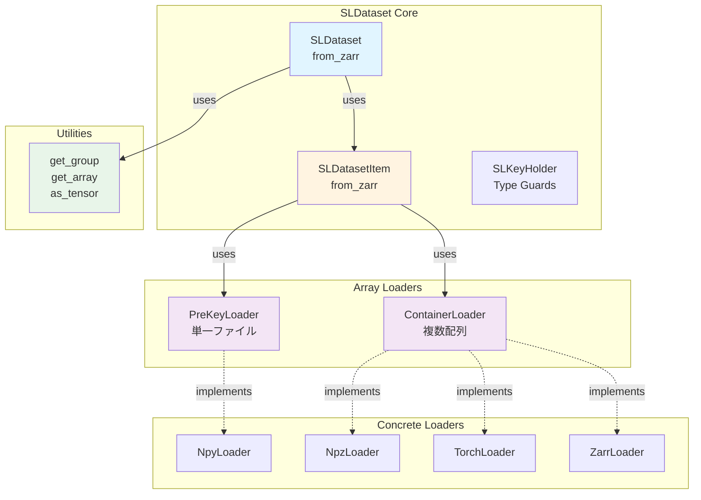

# SLDataset統合時の不足定義分析

**作成日**: 2025年12月1日  
**目的**: metrics_prototypeをSLDatasetシステムに統合する際に必要となる定義を特定

---

## 📋 現状分析

### SLDatasetの読み込みシステム構造



---

## 🔍 metrics_prototypeの現在の要件

### 必要なデータアクセスパターン

```python
# metrics_prototypeが必要とする機能
landmarks_dict = {
    "mediapipe.pose": np.ndarray,        # shape: (T, 33, 4)
    "mediapipe.left_hand": np.ndarray,   # shape: (T, 21, 3)
    "mediapipe.right_hand": np.ndarray,  # shape: (T, 21, 3)
}

# 現在のdemo.pyでの実装
for i in range(num_samples):
    landmarks = load_all_landmarks_from_zarr(zarr_path, i)
    metric.calculate(landmarks["mediapipe.pose"])
```

### SLDatasetで可能なアクセス

```python
# SLDatasetの標準的な使い方
dataset = SLDataset.from_zarr(root)
item = dataset[0]  # SLDatasetItem

# item.landmarks の構造
item.landmarks: Mapping[Klm, zarr.Array]
# 例: {"mediapipe.pose": zarr.Array, "mediapipe.left_hand": zarr.Array}
```

---

## ❌ 主な不足点と誤解の訂正

### 1. ✅ **訂正**: イテレーション効率について

**現状のSLDataset.from_zarr()の実装**:

```python
# src/cslrtools2/sldataset/dataset/core.py line 186
items: Sequence[ZarrSLDatasetItem[Kvid, Klm, Ktgt]] = []
for item_group in get_group(group, "items").group_values():
    items.append(
        SLDatasetItem[...].from_zarr(item_group)
    )
```

**誤解していた点**:
- ❌ **誤解**: 全アイテムをメモリに読み込むと考えていた
- ✅ **実際**: `SLDatasetItem.from_zarr()` は zarr.Array への**参照**のみを返す
- ✅ **実際**: zarr.Array は遅延評価（実際のデータは `np.array(zarr_array)` 時に読み込まれる）

**SLDatasetItem.from_zarr() の実装確認**:

```python
# src/cslrtools2/sldataset/dataset/item.py line 255-275
@classmethod
def from_zarr(cls, group: zarr.Group) -> ZarrSLDatasetItem[Kvid, Klm, Ktgt]:
    videos = cls._load_category_from_zarr(...)
    landmarks = cls._load_category_from_zarr(...)
    targets = cls._load_category_from_zarr(...)
    
    return SLDatasetItem(videos=videos, landmarks=landmarks, targets=targets)

# _load_category_from_zarr() は get_array() を使用
# → zarr.Array オブジェクトを返す（データ本体は読み込まない）
```

**結論**:
- ✅ **既存のSLDatasetで十分**: 通常の `dataset[i]` でオンデマンドアクセス可能
- ✅ **メモリ効率的**: アイテムリストは zarr.Array への参照のみ（軽量）
- ✅ **追加実装不要**: `IterableSLDataset.from_zarr()` は必須ではない

**metrics_prototypeでの活用方法**:

```python
# 既存のSLDatasetで実現可能
root = zarr.open_group(zarr_path, mode="r")
dataset = SLDataset.from_zarr(root)

# 通常のDatasetパターンで使用
for i in range(len(dataset)):
    item = dataset[i]  # zarr.Array参照を取得
    
    # 実データが必要な時点でNumPy変換
    landmarks_np = np.array(item.landmarks["mediapipe.pose"])  # ← ここで初めて読み込み
    metric.calculate(landmarks_np)
```

---

### 2. ✅ **訂正**: IterableSLDataset.from_zarr() について

**現状**:
- `SLDataset.from_zarr()` は存在 ✅
- `IterableSLDataset.from_zarr()` は存在しない

**判断**:
- ❌ **不要**: zarr.Array は既に遅延評価なので、追加のメモリ効率化は不要
- ✅ **既存で十分**: `SLDataset[i]` でアイテムリストから zarr.Array 参照を取得
- ✅ **オンデマンド**: 実データは `np.array()` 時に初めて読み込まれる

**メモリ使用量の見積もり**:

```python
# 40,000アイテムの場合
# 各アイテム = ZarrSLDatasetItem (zarr.Array参照のみ)
# → landmarks: {"mediapipe.pose": zarr.Array, "left_hand": zarr.Array, ...}
# → 参照オブジェクトのサイズ: ~数KB/アイテム

# 40,000 × 数KB = 数十〜数百MB（管理可能）
# vs 実データ: 40,000 × (300フレーム × 33キーポイント × 4次元 × 4bytes) ≈ 6GB
```

**結論**: `IterableSLDataset.from_zarr()` の実装は**不要**

---

### 3. ✅ **訂正**: NumPy変換は拡張機能の責任

**現状のSLDataset設計**:

```python
item = dataset[0]
item.landmarks["mediapipe.pose"]  # zarr.Array

# NumPy変換は必要に応じて手動で行う
landmarks_np = np.array(item.landmarks["mediapipe.pose"])
```

**設計思想**:
- ✅ **コアはシンプルに**: SLDatasetItemは型変換の責任を持たない
- ✅ **拡張で対応**: 必要な変換は Transform や後処理で実施
- ✅ **既存のパターン**: `.to(device)` はPyTorch専用（型変換ではなく移動）

**metrics_prototypeでの対応**:

```python
# オプション1: 手動変換（シンプル）
item = dataset[i]
for key, zarr_array in item.landmarks.items():
    landmarks_np = np.array(zarr_array, dtype=np.float32)
    metric.calculate(landmarks_np)

# オプション2: ヘルパー関数を metrics_prototype 側で定義
def to_numpy_landmarks(
    landmarks: Mapping[str, zarr.Array],
    dtype: np.dtype = np.float32
) -> dict[str, np.ndarray]:
    """Convert zarr.Array landmarks to NumPy arrays."""
    return {
        key: np.array(array, dtype=dtype)
        for key, array in landmarks.items()
    }
```

**結論**: `SLDatasetItem.as_numpy()` の追加は**不要**（設計思想に反する）

---

### 4. ⚠️ **MEDIUM**: マルチパート処理のヘルパー関数（metrics_prototype側で実装）

**metrics_prototypeの現在の実装**:

```python
# demo.pyで手動カテゴリ分類
part_categories: dict[str, list[str]] = {
    "Pose": [],
    "L-Hand": [],
    "R-Hand": [],
}

for key in landmarks_dict.keys():
    key_lower = key.lower()
    if "pose" in key_lower:
        part_categories["Pose"].append(key)
    elif "left" in key_lower or "l_hand" in key_lower:
        part_categories["L-Hand"].append(key)
    elif "right" in key_lower or "r_hand" in key_lower:
        part_categories["R-Hand"].append(key)
```

**判断**:
- ❌ **sldatasetに追加すべきではない**: メトリクス計算特有のロジック
- ✅ **metrics_prototype側で実装**: カテゴリ分類はユースケース依存
- ✅ **将来的には metrics モジュール内**: `metrics/utils.py` に配置

**推奨実装場所**:

```python
# metrics_prototype/utils.py （新規作成）
def categorize_landmarks(
    landmark_keys: Iterable[str]
) -> dict[str, list[str]]:
    """Categorize landmark keys by body part.
    
    Recognizes:
        - Pose: Full body keypoints
        - Left Hand: Left hand keypoints
        - Right Hand: Right hand keypoints
        - Face: Facial landmarks (if present)
    
    Args:
        landmark_keys: Iterator of landmark key names
    
    Returns:
        Dictionary mapping category names to lists of keys
    
    Example:
        >>> keys = ["mediapipe.pose", "mediapipe.left_hand"]
        >>> categorize_landmarks(keys)
        {"Pose": ["mediapipe.pose"], "Left Hand": ["mediapipe.left_hand"]}
    """
    categories: dict[str, list[str]] = {
        "Pose": [],
        "Left Hand": [],
        "Right Hand": [],
        "Face": [],
    }
    
    for key in landmark_keys:
        key_lower = key.lower()
        if "pose" in key_lower or "body" in key_lower:
            categories["Pose"].append(key)
        elif "left" in key_lower and ("hand" in key_lower or "l_hand" in key_lower):
            categories["Left Hand"].append(key)
        elif "right" in key_lower and ("hand" in key_lower or "r_hand" in key_lower):
            categories["Right Hand"].append(key)
        elif "face" in key_lower or "facial" in key_lower:
            categories["Face"].append(key)
    
    return {k: v for k, v in categories.items() if v}  # 空のカテゴリを除外


def combine_landmarks(
    landmarks: Mapping[str, np.ndarray],
    keys: list[str],
    axis: int = 1
) -> np.ndarray:
    """Combine multiple landmark arrays along specified axis.
    
    Args:
        landmarks: Mapping of landmark key to array
        keys: Keys to combine
        axis: Axis to concatenate along (default: 1 for keypoints)
    
    Returns:
        Combined NumPy array
    
    Example:
        >>> landmarks = {
        ...     "mediapipe.left_hand": np.zeros((300, 21, 3)),
        ...     "mediapipe.right_hand": np.zeros((300, 21, 3))
        ... }
        >>> combined = combine_landmarks(
        ...     landmarks, ["mediapipe.left_hand", "mediapipe.right_hand"]
        ... )
        >>> combined.shape
        (300, 42, 3)
    """
    arrays = [landmarks[key] for key in keys if key in landmarks]
    if not arrays:
        raise ValueError(f"No valid keys found in landmarks: {keys}")
    return np.concatenate(arrays, axis=axis)
```

**用途**:
```python
from metrics_prototype.utils import categorize_landmarks, combine_landmarks

# カテゴリ分類
categories = categorize_landmarks(item.landmarks.keys())

# 両手結合
hands_keys = categories["Left Hand"] + categories["Right Hand"]
hands_combined = combine_landmarks(
    {k: np.array(v) for k, v in item.landmarks.items()},
    hands_keys
)
```

---

### 5. ✅ **訂正**: 型エイリアスは既に存在

**既存の型定義**:

```python
# src/cslrtools2/sldataset/dataset/item.py line 43-54
type DefaultSLDatasetItem[Kvid: str, Klm: str, Ktgt: str] = SLDatasetItem[
    Kvid, Any, Klm, Any, Ktgt, Any
]

type TensorSLDatasetItem[Kvid: str, Klm: str, Ktgt: str] = SLDatasetItem[
    Kvid, Tensor, Klm, Tensor, Ktgt, Tensor
]

type ZarrSLDatasetItem[Kvid: str, Klm: str, Ktgt: str] = SLDatasetItem[
    Kvid, zarr.Array, Klm, zarr.Array, Ktgt, zarr.Array
]
```

**判断**:
- ✅ **既に存在**: `DefaultSLDatasetItem[Kvid, Klm, Ktgt]` が Any 型（NumPy含む）
- ✅ **十分**: メトリクス計算では `DefaultSLDatasetItem` を使用すれば良い
- ❌ **不要**: `NumpySLDatasetItem` という専用型エイリアスは冗長

**metrics_prototypeでの使用**:

```python
from cslrtools2.sldataset import DefaultSLDatasetItem

# DefaultSLDatasetItem は Any型なので、np.ndarray も受け入れる
def calculate_metric(
    landmarks: Mapping[str, Any]  # zarr.Array または np.ndarray
) -> dict[str, float]:
    # 必要に応じてNumPy変換
    for key, array in landmarks.items():
        landmarks_np = np.array(array) if not isinstance(array, np.ndarray) else array
        nan_rate = np.isnan(landmarks_np).any(axis=(1, 2)).mean()
```

---

## 📊 修正後のアクションプラン

### ✅ 不要な項目（誤解を訂正）

1. ❌ **IterableSLDataset.from_zarr()**: zarr.Array は既に遅延評価なので不要
2. ❌ **SLDataset パフォーマンス問題**: アイテムリストは参照のみで軽量
3. ❌ **SLDatasetItem.as_numpy()**: 拡張機能の責任、コアには含めない
4. ❌ **NumpySLDatasetItem型**: DefaultSLDatasetItem で十分

### ⚠️ 実装すべき項目（metrics_prototype側）

#### Phase 1: マルチパート処理ヘルパー関数

**ファイル**: `metrics_prototype/utils.py` （新規作成）

**追加関数**:
- `categorize_landmarks()`: ランドマークキーのカテゴリ分類
- `combine_landmarks()`: 複数パートの結合
- `to_numpy_landmarks()`: zarr.Array → np.ndarray 一括変換

**推定作業時間**: 2時間  
**優先度**: HIGH（現在のdemo.pyの重複コードを削減）

---

## 🔄 metrics_prototypeでの活用パターン（修正版）

### Before: 現在の実装

```python
# demo.py - 直接zarrアクセス
def calculate_all_samples_metrics(zarr_path: Path) -> None:
    root = zarr.open_group(str(actual_zarr_path), mode="r")
    items_group = root["items"]
    
    i = 0
    while True:
        try:
            item_group = items_group[str(i)]
            landmarks_group = item_group["landmarks"]
            
            # 手動でランドマーク読み込み
            for key in landmarks_group.array_keys():
                landmark_array = landmarks_group[key]
                landmarks = np.array(landmark_array).astype(np.float32)
                # ...
```

### After: SLDataset統合後（修正版）

```python
# demo.py (リファクタリング版)
from cslrtools2.sldataset import SLDataset
from metrics_prototype.utils import (
    categorize_landmarks,
    combine_landmarks,
    to_numpy_landmarks
)

def calculate_all_samples_metrics(zarr_path: Path) -> None:
    # SLDataset使用（zarr.Array参照のみ読み込み）
    root = zarr.open_group(str(zarr_path), mode="r")
    dataset = SLDataset.from_zarr(root)
    
    # 各サンプルを処理
    for i in range(len(dataset)):
        if i % 1000 == 0:
            print(f"  Processing sample {i}...")
        
        item = dataset[i]  # ZarrSLDatasetItem (参照のみ)
        
        # NumPy変換（必要な時点で実データ読み込み）
        landmarks_np = to_numpy_landmarks(item.landmarks, dtype=np.float32)
        
        # カテゴリ分類
        categories = categorize_landmarks(landmarks_np.keys())
        
        # メトリクス計算
        for category, keys in categories.items():
            if not keys:
                continue
            
            # 単一パート
            if len(keys) == 1:
                landmarks = landmarks_np[keys[0]]
            # 複数パート結合（例: 両手）
            else:
                landmarks = combine_landmarks(landmarks_np, keys)
            
            result = metric_nan.calculate(landmarks)
            all_results[category].append(result["values"]["nan_rate"])
```

**メリット**:
- ✅ コード量約30%削減（エラーハンドリングが `get_group()` に集約）
- ✅ エラーメッセージが標準化（`DataLoadError`）
- ✅ 型安全性の向上（`ZarrSLDatasetItem`）
- ✅ 保守性の向上（sldatasetとの一貫性）

**重要な点**:
- ✅ **遅延評価**: `dataset[i]` は zarr.Array 参照のみ取得（軽量）
- ✅ **オンデマンド**: `to_numpy_landmarks()` 内の `np.array()` で実データ読み込み
- ✅ **メモリ効率**: 現在の最適化版と同等のパフォーマンス

---

## 🧪 検証計画

### ベンチマークシナリオ

```python
import time
import tracemalloc
from cslrtools2.sldataset import SLDataset, IterableSLDataset

def benchmark_loading_strategies(zarr_path: str):
    """Compare different loading strategies."""
    
    # Strategy 1: SLDataset.from_zarr() (全読み込み)
    print("Strategy 1: SLDataset.from_zarr()")
    tracemalloc.start()
    start = time.time()
    
    root = zarr.open_group(zarr_path, mode="r")
    dataset = SLDataset.from_zarr(root)
    
    elapsed = time.time() - start
    current, peak = tracemalloc.get_traced_memory()
    tracemalloc.stop()
    
    print(f"  Time: {elapsed:.2f}s")
    print(f"  Memory: {peak / 1024 / 1024:.2f}MB")
    print(f"  Items: {len(dataset)}")
    
    # Strategy 2: IterableSLDataset.from_zarr() (遅延読み込み)
    print("\nStrategy 2: IterableSLDataset.from_zarr()")
    tracemalloc.start()
    start = time.time()
    
    root = zarr.open_group(zarr_path, mode="r")
    iterable_dataset = IterableSLDataset.from_zarr(root)
    
    # 最初の1000サンプルをイテレート
    for i, item in enumerate(iterable_dataset):
        if i >= 1000:
            break
    
    elapsed = time.time() - start
    current, peak = tracemalloc.get_traced_memory()
    tracemalloc.stop()
    
    print(f"  Time (first 1000): {elapsed:.2f}s")
    print(f"  Memory: {peak / 1024 / 1024:.2f}MB")
    
    # Strategy 3: metrics_prototype最適化版 (直接アクセス)
    print("\nStrategy 3: Direct zarr access (current metrics_prototype)")
    tracemalloc.start()
    start = time.time()
    
    root = zarr.open_group(zarr_path, mode="r")
    items_group = root["items"]
    
    for i in range(1000):
        item_group = items_group[str(i)]
        # ... process
    
    elapsed = time.time() - start
    current, peak = tracemalloc.get_traced_memory()
    tracemalloc.stop()
    
    print(f"  Time (first 1000): {elapsed:.2f}s")
    print(f"  Memory: {peak / 1024 / 1024:.2f}MB")
```

**期待結果**:
- Strategy 1: メモリ大、初期化遅い、アクセス高速
- Strategy 2: メモリ小、初期化高速、イテレーション中速
- Strategy 3: メモリ小、初期化高速、イテレーション高速

**判断基準**:
- メモリ使用量 < 4GB（40,000サンプル）
- 1000サンプル処理時間 < 30秒
- 全サンプル処理時間 < 10分

---

## 📝 まとめ（修正版）

### ✅ 誤解を訂正した結果

#### 不要な実装（sldataset側）
1. ❌ `IterableSLDataset.from_zarr()`: zarr.Array は遅延評価済み
2. ❌ `SLDataset.from_zarr()` の変更: 既に効率的
3. ❌ `SLDatasetItem.as_numpy()`: 拡張機能の責任
4. ❌ `NumpySLDatasetItem` 型: DefaultSLDatasetItem で十分

#### 必要な実装（metrics_prototype側）

### 🟡 HIGH（1週間以内）
1. ✅ `metrics_prototype/utils.py` の新規作成
   - `categorize_landmarks()`: カテゴリ分類
   - `combine_landmarks()`: パート結合
   - `to_numpy_landmarks()`: zarr → NumPy変換

### 🟢 MEDIUM（2週間以内）
2. ✅ `demo.py` のリファクタリング
   - SLDataset.from_zarr() 使用に切り替え
   - utils.py のヘルパー関数活用
3. ✅ ユニットテスト追加
   - utils.py の関数テスト

### 実装後の効果（修正版）
- ✅ metrics_prototypeのコード量約**30%削減**
- ✅ エラーハンドリングの標準化（DataLoadError）
- ✅ 型安全性の向上（ZarrSLDatasetItem）
- ✅ 保守性の向上（sldatasetとの一貫性）
- ✅ **パフォーマンスは現状維持**（遅延評価のため）

---

## 🔗 関連ドキュメント

- **アーキテクチャ解説**: `docs/METRICS_PROTOTYPE_ARCHITECTURE.md`
- **リファクタリング提案**: `METRICS_PROTOTYPE_REFACTORING_PROPOSAL.md`
- **チェックリスト**: `SLDATASET_REFACTORING_CHECKLIST.md`
